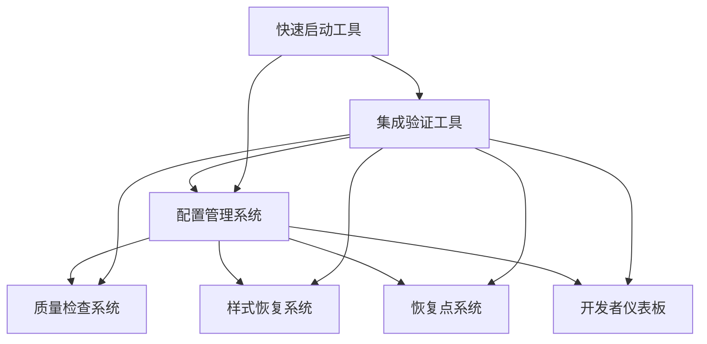

# 🛠️ Kiro 项目管理规则增强系统

## 📋 系统概述

Kiro 是一套完整的项目管理规则增强系统，为 Inspi.AI 项目提供全面的开发流程管理、质量保证和系统监控功能。

## 🏗️ 系统架构

```
Kiro 项目管理规则增强系统
├── 🔍 质量检查系统 (quality-checks/)
├── 🎨 样式恢复系统 (style-recovery/)  
├── 📦 恢复点系统 (recovery-points/)
├── 📊 开发者仪表板 (dashboard/)
├── ⚙️ 配置管理系统 (config-manager/)
├── 🔗 集成验证工具 (integration-tests/)
├── 📝 规范文档 (specs/)
└── 🚀 快速启动工具 (quick-start.js)
```

## 🎯 核心系统

### 1. 质量检查系统 (`quality-checks/`)
**功能**: 代码质量监控和功能完整性验证
- 实时代码质量监控
- 自动化功能测试
- 智能问题预警系统
- 质量报告生成

```bash
# 运行质量检查
node .kiro/quality-checks/cli.js check

# 查看质量报告  
node .kiro/quality-checks/cli.js report

# 全面质量检查
node .kiro/quality-checks/cli.js full-check
```

### 2. 样式恢复系统 (`style-recovery/`)
**功能**: 样式版本控制和视觉回归检测
- 自动样式快照管理
- 视觉回归检测
- 一键样式回滚
- 样式变更历史

```bash
# 创建样式快照
node .kiro/style-recovery/cli.js snapshot

# 检测视觉回归
node .kiro/style-recovery/cli.js detect

# 回滚样式
node .kiro/style-recovery/cli.js rollback
```

### 3. 恢复点系统 (`recovery-points/`)
**功能**: 项目状态管理和智能恢复
- 自动恢复点创建
- 选择性状态恢复
- 恢复操作指导
- 状态变更追踪

```bash
# 创建恢复点
node .kiro/recovery-points/cli.js create

# 选择性恢复
node .kiro/recovery-points/cli.js recover

# 查看恢复指导
node .kiro/recovery-points/cli.js guide
```

### 4. 开发者仪表板 (`dashboard/`)
**功能**: 项目健康监控和一键操作
- 实时项目健康监控
- 一键操作工具集
- 操作历史审计
- 系统状态可视化

```bash
# 启动仪表板
node .kiro/dashboard/cli.js start

# 查看项目健康状态
node .kiro/dashboard/cli.js health

# 查看操作历史
node .kiro/dashboard/cli.js history
```

### 5. 配置管理系统 (`config-manager/`)
**功能**: 统一配置管理和同步
- 集中配置管理
- 配置验证同步
- 配置变更通知
- 配置备份恢复

```bash
# 查看配置状态
node .kiro/config-manager/cli.js status

# 同步配置
node .kiro/config-manager/cli.js sync

# 验证配置
node .kiro/config-manager/cli.js validate
```

### 6. 集成验证工具 (`integration-tests/`)
**功能**: 系统集成验证和监控
- 系统集成状态验证
- 数据流连通性测试
- 接口兼容性检查
- 集成健康报告

```bash
# 运行集成测试
node .kiro/integration-tests/run-tests.js

# 查看集成状态
node .kiro/integration-tests/cli.js status

# 生成集成报告
node .kiro/integration-tests/cli.js report
```

## 🚀 快速启动

### 使用快速启动脚本
```bash
# 查看帮助
node .kiro/quick-start.js --help

# 检查环境
node .kiro/quick-start.js --check

# 查看可用系统
node .kiro/quick-start.js --list

# 启用特定系统
node .kiro/quick-start.js --enable quality-checks

# 启用所有系统
node .kiro/quick-start.js --enable-all

# 交互模式
node .kiro/quick-start.js
```

### 使用 Shell 包装脚本
```bash
# 更简单的命令行接口
./quick-start.sh --check
./quick-start.sh --enable dashboard
```

## 📊 系统集成状态

### 最新验证结果
- **验证时间**: 2025年9月5日
- **总体状态**: 🟢 优秀 (100% 通过率)
- **系统健康度**: 6/6 系统正常
- **数据流完整性**: 100% 正常
- **接口兼容性**: 100% 兼容

### 系统依赖关系


## 🔧 开发工作流集成

### 日常开发流程
1. **开始开发**
   ```bash
   # 检查系统状态
   node .kiro/integration-tests/cli.js status
   
   # 启动监控仪表板
   node .kiro/dashboard/cli.js start
   ```

2. **开发过程中**
   ```bash
   # 运行质量检查
   node .kiro/quality-checks/cli.js check
   
   # 创建样式快照 (UI变更前)
   node .kiro/style-recovery/cli.js snapshot
   
   # 创建恢复点 (重要变更前)
   node .kiro/recovery-points/cli.js create
   ```

3. **提交前检查**
   ```bash
   # 运行完整验证
   node .kiro/integration-tests/run-tests.js
   
   # 检测视觉回归
   node .kiro/style-recovery/cli.js detect
   
   # 全面质量检查
   node .kiro/quality-checks/cli.js full-check
   ```

### 问题处理流程
1. **问题发现** → 查看仪表板警告
2. **问题诊断** → 使用诊断工具
3. **问题修复** → 使用恢复系统
4. **验证修复** → 运行集成验证

## 📚 文档导航

### 系统文档
- **[质量检查系统](quality-checks/README.md)** - 详细使用指南
- **[样式恢复系统](style-recovery/README.md)** - 样式管理文档
- **[恢复点系统](recovery-points/README.md)** - 恢复机制说明
- **[开发者仪表板](dashboard/README.md)** - 仪表板使用指南
- **[配置管理系统](config-manager/README.md)** - 配置管理文档
- **[集成验证工具](integration-tests/README.md)** - 集成测试指南

### 规范文档
- **[项目管理规则增强](specs/project-management-rules-enhancement/)** - 系统设计规范
- **[版本管理系统](specs/version-management-system/)** - 版本控制规范
- **[PC UI增强](specs/pc-ui-enhancement/)** - PC端UI规范
- **[主应用规范](specs/inspi-ai-platform/)** - 主应用开发规范

### 使用指南
- **[快速启动指南](QUICK_START_README.md)** - 系统快速启动
- **[使用示例](QUICK_START_EXAMPLES.md)** - 详细使用示例

## ⚙️ 系统配置

### 环境要求
- Node.js >= 16.0.0
- npm 或 yarn
- Git 仓库
- 相关依赖包 (根据启用的系统而定)

### 系统依赖
- **样式恢复系统**: playwright (视觉回归检测)
- **质量检查系统**: jest (测试框架)
- **开发者仪表板**: express (Web服务)

### 配置文件
- **快速启动配置**: `quick-start-config.json`
- **各系统配置**: 各系统目录下的 `config.json`
- **集成配置**: `integration-tests/config.json`

## 🔍 监控和维护

### 系统监控
```bash
# 查看系统整体状态
node .kiro/integration-tests/cli.js status

# 查看各系统健康状态
node .kiro/dashboard/cli.js health

# 查看配置状态
node .kiro/config-manager/cli.js status
```

### 维护操作
```bash
# 系统诊断
node .kiro/config-manager/cli.js diagnose

# 清理临时文件
node .kiro/dashboard/cli.js cleanup

# 重置系统配置
node .kiro/config-manager/cli.js reset
```

## 🎯 系统特性

### 🔍 智能监控
- 实时项目健康监控
- 自动问题检测和预警
- 全面的系统集成验证

### 🛡️ 安全保障
- 多层次的恢复机制
- 自动备份和快照
- 操作历史完整审计

### ⚡ 高效工具
- 一键操作工具集
- 自动化工作流程
- 智能配置管理

### 📊 可视化管理
- 直观的仪表板界面
- 详细的状态报告
- 清晰的操作指导

## 📞 支持信息

### 获取帮助
```bash
# 查看各系统帮助
node .kiro/quality-checks/cli.js help
node .kiro/style-recovery/cli.js help
node .kiro/recovery-points/cli.js help
node .kiro/dashboard/cli.js help
node .kiro/config-manager/cli.js help
node .kiro/integration-tests/cli.js help
```

### 联系方式
- **项目邮箱**: sundp1980@gmail.com
- **技术支持**: 运行系统诊断工具获取详细信息
- **文档问题**: 查看相关系统的README文档

---

**系统版本**: v1.0.0  
**最后更新**: 2025年9月5日  
**维护状态**: 🟢 正常运行  
**集成状态**: 🟢 优秀 (100% 通过率)