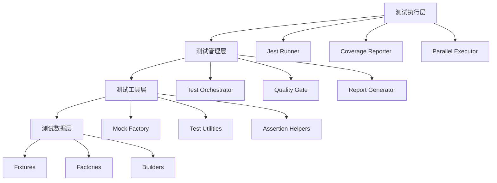

# 全面单元测试计划设计文档

## 概述

本设计文档基于需求分析，为Inspi.AI平台制定了一个全面、系统化的单元测试架构。设计采用分层测试策略，结合现有的测试基础设施，通过模块化、自动化的方式实现高质量的测试覆盖。

## 架构设计

### 测试架构层次



### 核心组件架构

#### 1. 测试分类系统

```typescript
interface TestClassification {
  priority: 'P0' | 'P1' | 'P2';
  category: 'unit' | 'integration' | 'e2e';
  module: string;
  coverage: {
    target: number;
    current: number;
  };
}
```

#### 2. 测试执行引擎

```typescript
interface TestExecutor {
  runSuite(suite: TestSuite): Promise<TestResult>;
  runParallel(suites: TestSuite[]): Promise<TestResult[]>;
  generateReport(results: TestResult[]): TestReport;
  validateCoverage(coverage: Coverage): boolean;
}
```

## 组件和接口设计

### 1. 测试管理器 (TestManager)

```typescript
class TestManager {
  private config: TestConfig;
  private executor: TestExecutor;
  private reporter: TestReporter;
  
  async runTests(options: TestOptions): Promise<TestResult> {
    // 测试执行逻辑
  }
  
  async generateCoverageReport(): Promise<CoverageReport> {
    // 覆盖率报告生成
  }
  
  async validateQualityGates(): Promise<QualityGateResult> {
    // 质量门禁验证
  }
}
```

### 2. 测试数据工厂 (TestDataFactory)

```typescript
class TestDataFactory {
  createUser(overrides?: Partial<User>): User;
  createWork(overrides?: Partial<Work>): Work;
  createKnowledgeGraph(overrides?: Partial<KnowledgeGraph>): KnowledgeGraph;
  
  // 批量创建
  createUsers(count: number): User[];
  createWorks(count: number): Work[];
  
  // 关联数据创建
  createUserWithWorks(workCount: number): { user: User; works: Work[] };
}
```

### 3. Mock服务管理器 (MockServiceManager)

```typescript
class MockServiceManager {
  private mocks: Map<string, MockService>;
  
  registerMock(name: string, mock: MockService): void;
  getMock(name: string): MockService;
  resetAllMocks(): void;
  
  // 特定服务Mock
  mockGeminiService(): MockGeminiService;
  mockEmailService(): MockEmailService;
  mockDatabaseService(): MockDatabaseService;
}
```

### 4. 测试报告生成器 (TestReportGenerator)

```typescript
class TestReportGenerator {
  generateHtmlReport(results: TestResult[]): string;
  generateJsonReport(results: TestResult[]): object;
  generateMarkdownReport(results: TestResult[]): string;
  
  generateCoverageReport(coverage: Coverage): CoverageReport;
  generateTrendReport(historical: TestResult[]): TrendReport;
}
```

## 数据模型设计

### 测试配置模型

```typescript
interface TestConfig {
  coverage: {
    threshold: {
      statements: number;
      branches: number;
      functions: number;
      lines: number;
    };
    exclude: string[];
    include: string[];
  };
  
  execution: {
    timeout: number;
    maxWorkers: number;
    parallel: boolean;
    bail: boolean;
  };
  
  reporting: {
    formats: ('html' | 'json' | 'markdown')[];
    outputDir: string;
    verbose: boolean;
  };
  
  quality: {
    gates: QualityGate[];
    notifications: NotificationConfig[];
  };
}
```

### 测试结果模型

```typescript
interface TestResult {
  suite: string;
  tests: TestCase[];
  coverage: Coverage;
  performance: PerformanceMetrics;
  timestamp: Date;
  duration: number;
  status: 'passed' | 'failed' | 'skipped';
}

interface TestCase {
  name: string;
  status: 'passed' | 'failed' | 'skipped';
  duration: number;
  error?: TestError;
  assertions: number;
}
```

### 覆盖率模型

```typescript
interface Coverage {
  statements: CoverageMetric;
  branches: CoverageMetric;
  functions: CoverageMetric;
  lines: CoverageMetric;
  files: FileCoverage[];
}

interface CoverageMetric {
  total: number;
  covered: number;
  percentage: number;
}
```

## 错误处理设计

### 错误分类系统

```typescript
enum TestErrorType {
  ASSERTION_FAILED = 'assertion_failed',
  TIMEOUT = 'timeout',
  SETUP_FAILED = 'setup_failed',
  TEARDOWN_FAILED = 'teardown_failed',
  MOCK_FAILED = 'mock_failed',
  COVERAGE_FAILED = 'coverage_failed'
}

class TestError extends Error {
  constructor(
    public type: TestErrorType,
    public message: string,
    public context?: any
  ) {
    super(message);
  }
}
```

### 错误恢复策略

```typescript
interface ErrorRecoveryStrategy {
  canRecover(error: TestError): boolean;
  recover(error: TestError): Promise<void>;
  getRetryCount(): number;
}

class TestErrorHandler {
  private strategies: Map<TestErrorType, ErrorRecoveryStrategy>;
  
  async handleError(error: TestError): Promise<boolean> {
    const strategy = this.strategies.get(error.type);
    if (strategy && strategy.canRecover(error)) {
      await strategy.recover(error);
      return true;
    }
    return false;
  }
}
```

## 测试策略设计

### 1. 分层测试策略

#### P0 - 核心业务逻辑 (100%覆盖)
- **AI服务模块**: Gemini集成、提示词处理、响应验证
- **认证系统**: JWT处理、会话管理、权限验证
- **数据模型**: 核心实体模型、关系处理、验证逻辑
- **关键API**: 认证、魔法生成、健康检查

#### P1 - 重要功能模块 (95%覆盖)
- **邮件服务**: 发送、模板、验证
- **配额管理**: 检查、消费、通知
- **缓存系统**: Redis操作、缓存策略
- **工具函数**: 日志、验证、辅助函数
- **React Hooks**: 响应式、状态管理、副作用

#### P2 - 支持功能模块 (85%覆盖)
- **UI组件**: 渲染、交互、样式
- **中间件**: 请求处理、错误处理
- **状态管理**: Store操作、状态同步
- **类型定义**: 类型验证、接口一致性

### 2. 测试类型策略

#### 单元测试 (Unit Tests)
```typescript
// 示例：AI服务单元测试
describe('GeminiService', () => {
  let service: GeminiService;
  let mockApiClient: jest.Mocked<ApiClient>;
  
  beforeEach(() => {
    mockApiClient = createMockApiClient();
    service = new GeminiService(mockApiClient);
  });
  
  describe('generateCard', () => {
    it('should generate card with valid input', async () => {
      // Arrange
      const input = createValidCardInput();
      const expectedResponse = createExpectedCardResponse();
      mockApiClient.post.mockResolvedValue(expectedResponse);
      
      // Act
      const result = await service.generateCard(input);
      
      // Assert
      expect(result).toMatchObject(expectedResponse);
      expect(mockApiClient.post).toHaveBeenCalledWith(
        '/generate',
        expect.objectContaining(input)
      );
    });
  });
});
```

#### 集成测试 (Integration Tests)
```typescript
// 示例：API集成测试
describe('Magic API Integration', () => {
  let app: Application;
  let testDb: TestDatabase;
  
  beforeAll(async () => {
    testDb = await createTestDatabase();
    app = createTestApp(testDb);
  });
  
  afterAll(async () => {
    await testDb.cleanup();
  });
  
  it('should generate card end-to-end', async () => {
    const user = await testDb.createUser();
    const token = generateTestToken(user);
    
    const response = await request(app)
      .post('/api/magic/generate')
      .set('Authorization', `Bearer ${token}`)
      .send(validCardRequest)
      .expect(200);
      
    expect(response.body).toHaveProperty('card');
    expect(response.body.card).toMatchSchema(cardSchema);
  });
});
```

### 3. Mock策略设计

#### 外部服务Mock
```typescript
class MockGeminiService implements GeminiService {
  private responses: Map<string, any> = new Map();
  
  setMockResponse(input: string, response: any): void {
    this.responses.set(input, response);
  }
  
  async generateCard(input: CardInput): Promise<CardResponse> {
    const key = JSON.stringify(input);
    const response = this.responses.get(key);
    
    if (!response) {
      throw new Error(`No mock response for input: ${key}`);
    }
    
    // 模拟网络延迟
    await new Promise(resolve => setTimeout(resolve, 100));
    
    return response;
  }
}
```

#### 数据库Mock
```typescript
class MockDatabase implements Database {
  private collections: Map<string, any[]> = new Map();
  
  async find<T>(collection: string, query: any): Promise<T[]> {
    const items = this.collections.get(collection) || [];
    return items.filter(item => this.matchesQuery(item, query));
  }
  
  async create<T>(collection: string, data: T): Promise<T> {
    const items = this.collections.get(collection) || [];
    const newItem = { ...data, _id: generateId() };
    items.push(newItem);
    this.collections.set(collection, items);
    return newItem;
  }
  
  private matchesQuery(item: any, query: any): boolean {
    // 简单的查询匹配逻辑
    return Object.keys(query).every(key => item[key] === query[key]);
  }
}
```

## 性能优化设计

### 1. 并行执行策略

```typescript
class ParallelTestExecutor {
  private maxWorkers: number;
  private workerPool: WorkerPool;
  
  constructor(maxWorkers: number = os.cpus().length) {
    this.maxWorkers = maxWorkers;
    this.workerPool = new WorkerPool(maxWorkers);
  }
  
  async runTestsInParallel(testSuites: TestSuite[]): Promise<TestResult[]> {
    const chunks = this.chunkTestSuites(testSuites, this.maxWorkers);
    const promises = chunks.map(chunk => this.runChunk(chunk));
    
    const results = await Promise.all(promises);
    return results.flat();
  }
  
  private chunkTestSuites(suites: TestSuite[], chunkSize: number): TestSuite[][] {
    const chunks: TestSuite[][] = [];
    for (let i = 0; i < suites.length; i += chunkSize) {
      chunks.push(suites.slice(i, i + chunkSize));
    }
    return chunks;
  }
}
```

### 2. 缓存策略

```typescript
class TestCacheManager {
  private cache: Map<string, TestResult> = new Map();
  
  getCachedResult(testHash: string): TestResult | null {
    return this.cache.get(testHash) || null;
  }
  
  setCachedResult(testHash: string, result: TestResult): void {
    this.cache.set(testHash, result);
  }
  
  generateTestHash(testFile: string, dependencies: string[]): string {
    const content = fs.readFileSync(testFile, 'utf8');
    const depHashes = dependencies.map(dep => this.getFileHash(dep));
    
    return crypto
      .createHash('md5')
      .update(content + depHashes.join(''))
      .digest('hex');
  }
  
  private getFileHash(filePath: string): string {
    const content = fs.readFileSync(filePath, 'utf8');
    return crypto.createHash('md5').update(content).digest('hex');
  }
}
```

### 3. 增量测试

```typescript
class IncrementalTestRunner {
  private gitHelper: GitHelper;
  private dependencyAnalyzer: DependencyAnalyzer;
  
  async getAffectedTests(changedFiles: string[]): Promise<string[]> {
    const affectedFiles = await this.dependencyAnalyzer.getAffectedFiles(changedFiles);
    const testFiles = await this.findTestFiles(affectedFiles);
    
    return testFiles;
  }
  
  async runIncrementalTests(): Promise<TestResult> {
    const changedFiles = await this.gitHelper.getChangedFiles();
    const affectedTests = await this.getAffectedTests(changedFiles);
    
    if (affectedTests.length === 0) {
      return { status: 'skipped', message: 'No tests affected' };
    }
    
    return await this.runTests(affectedTests);
  }
}
```

## 质量保证设计

### 1. 质量门禁系统

```typescript
interface QualityGate {
  name: string;
  condition: QualityCondition;
  action: QualityAction;
}

interface QualityCondition {
  type: 'coverage' | 'performance' | 'security';
  threshold: number;
  operator: 'gte' | 'lte' | 'eq';
}

class QualityGateValidator {
  private gates: QualityGate[];
  
  async validateAll(testResult: TestResult): Promise<QualityGateResult> {
    const results = await Promise.all(
      this.gates.map(gate => this.validateGate(gate, testResult))
    );
    
    const failed = results.filter(r => !r.passed);
    
    return {
      passed: failed.length === 0,
      results,
      failedGates: failed
    };
  }
  
  private async validateGate(
    gate: QualityGate, 
    testResult: TestResult
  ): Promise<GateResult> {
    switch (gate.condition.type) {
      case 'coverage':
        return this.validateCoverage(gate, testResult.coverage);
      case 'performance':
        return this.validatePerformance(gate, testResult.performance);
      case 'security':
        return this.validateSecurity(gate, testResult);
      default:
        throw new Error(`Unknown gate type: ${gate.condition.type}`);
    }
  }
}
```

### 2. 测试稳定性监控

```typescript
class TestStabilityMonitor {
  private history: Map<string, TestHistory[]> = new Map();
  
  recordTestResult(testName: string, result: TestCaseResult): void {
    const history = this.history.get(testName) || [];
    history.push({
      timestamp: new Date(),
      status: result.status,
      duration: result.duration,
      error: result.error
    });
    
    // 保留最近100次记录
    if (history.length > 100) {
      history.shift();
    }
    
    this.history.set(testName, history);
  }
  
  getFlakiness(testName: string): number {
    const history = this.history.get(testName) || [];
    if (history.length < 10) return 0;
    
    const failures = history.filter(h => h.status === 'failed').length;
    return failures / history.length;
  }
  
  getFlakyTests(threshold: number = 0.1): string[] {
    const flakyTests: string[] = [];
    
    for (const [testName] of this.history) {
      if (this.getFlakiness(testName) > threshold) {
        flakyTests.push(testName);
      }
    }
    
    return flakyTests;
  }
}
```

## 报告和监控设计

### 1. 实时监控仪表板

```typescript
class TestDashboard {
  private metrics: TestMetrics;
  private websocket: WebSocketServer;
  
  async startRealTimeMonitoring(): Promise<void> {
    this.websocket.on('connection', (socket) => {
      // 发送当前状态
      socket.send(JSON.stringify(this.getCurrentStatus()));
      
      // 订阅更新
      this.metrics.on('update', (data) => {
        socket.send(JSON.stringify(data));
      });
    });
  }
  
  private getCurrentStatus(): DashboardStatus {
    return {
      totalTests: this.metrics.getTotalTests(),
      passRate: this.metrics.getPassRate(),
      coverage: this.metrics.getCoverage(),
      performance: this.metrics.getPerformanceMetrics(),
      trends: this.metrics.getTrends()
    };
  }
}
```

### 2. 历史趋势分析

```typescript
class TestTrendAnalyzer {
  private database: TrendDatabase;
  
  async analyzeCoverageTrend(days: number = 30): Promise<CoverageTrend> {
    const data = await this.database.getCoverageHistory(days);
    
    return {
      trend: this.calculateTrend(data),
      average: this.calculateAverage(data),
      prediction: this.predictFuture(data),
      recommendations: this.generateRecommendations(data)
    };
  }
  
  async analyzePerformanceTrend(days: number = 30): Promise<PerformanceTrend> {
    const data = await this.database.getPerformanceHistory(days);
    
    return {
      executionTime: this.analyzeExecutionTime(data),
      memoryUsage: this.analyzeMemoryUsage(data),
      flakyTests: this.analyzeFlakyTests(data),
      bottlenecks: this.identifyBottlenecks(data)
    };
  }
}
```

## 安全和合规设计

### 1. 测试数据安全

```typescript
class SecureTestDataManager {
  private encryption: EncryptionService;
  
  async createSecureTestData<T>(data: T): Promise<SecureTestData<T>> {
    const encrypted = await this.encryption.encrypt(JSON.stringify(data));
    
    return {
      id: generateId(),
      data: encrypted,
      createdAt: new Date(),
      expiresAt: new Date(Date.now() + 24 * 60 * 60 * 1000) // 24小时后过期
    };
  }
  
  async getSecureTestData<T>(id: string): Promise<T | null> {
    const secureData = await this.database.findById(id);
    
    if (!secureData || secureData.expiresAt < new Date()) {
      return null;
    }
    
    const decrypted = await this.encryption.decrypt(secureData.data);
    return JSON.parse(decrypted);
  }
  
  async cleanupExpiredData(): Promise<void> {
    await this.database.deleteMany({
      expiresAt: { $lt: new Date() }
    });
  }
}
```

### 2. 合规性检查

```typescript
class ComplianceChecker {
  private rules: ComplianceRule[];
  
  async checkCompliance(testSuite: TestSuite): Promise<ComplianceReport> {
    const violations: ComplianceViolation[] = [];
    
    for (const rule of this.rules) {
      const result = await rule.check(testSuite);
      if (!result.passed) {
        violations.push({
          rule: rule.name,
          severity: rule.severity,
          message: result.message,
          location: result.location
        });
      }
    }
    
    return {
      passed: violations.length === 0,
      violations,
      score: this.calculateComplianceScore(violations)
    };
  }
}
```

## 扩展性设计

### 1. 插件系统

```typescript
interface TestPlugin {
  name: string;
  version: string;
  hooks: TestHooks;
}

interface TestHooks {
  beforeAll?: () => Promise<void>;
  afterAll?: () => Promise<void>;
  beforeEach?: (test: TestCase) => Promise<void>;
  afterEach?: (test: TestCase, result: TestResult) => Promise<void>;
}

class TestPluginManager {
  private plugins: Map<string, TestPlugin> = new Map();
  
  registerPlugin(plugin: TestPlugin): void {
    this.plugins.set(plugin.name, plugin);
  }
  
  async executeHook(hookName: keyof TestHooks, ...args: any[]): Promise<void> {
    for (const plugin of this.plugins.values()) {
      const hook = plugin.hooks[hookName];
      if (hook) {
        await hook(...args);
      }
    }
  }
}
```

### 2. 自定义断言

```typescript
class CustomAssertions {
  static toBeValidCard(received: any): jest.CustomMatcherResult {
    const pass = this.isValidCard(received);
    
    return {
      pass,
      message: () => pass
        ? `Expected ${received} not to be a valid card`
        : `Expected ${received} to be a valid card`
    };
  }
  
  static toHavePerformanceWithin(
    received: number, 
    expected: number, 
    tolerance: number = 0.1
  ): jest.CustomMatcherResult {
    const pass = Math.abs(received - expected) <= tolerance;
    
    return {
      pass,
      message: () => pass
        ? `Expected ${received} not to be within ${tolerance} of ${expected}`
        : `Expected ${received} to be within ${tolerance} of ${expected}`
    };
  }
  
  private static isValidCard(card: any): boolean {
    return card &&
           typeof card.title === 'string' &&
           typeof card.content === 'string' &&
           Array.isArray(card.tags);
  }
}

// 扩展Jest匹配器
declare global {
  namespace jest {
    interface Matchers<R> {
      toBeValidCard(): R;
      toHavePerformanceWithin(expected: number, tolerance?: number): R;
    }
  }
}
```

这个设计文档提供了一个全面的单元测试架构，涵盖了测试执行、数据管理、质量保证、性能优化、安全合规等各个方面。设计采用模块化、可扩展的架构，能够满足项目当前和未来的测试需求。