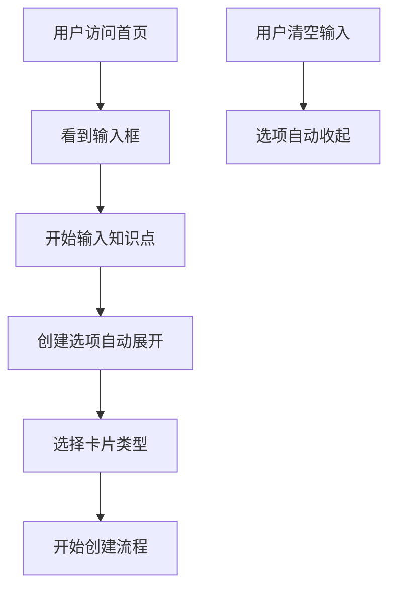
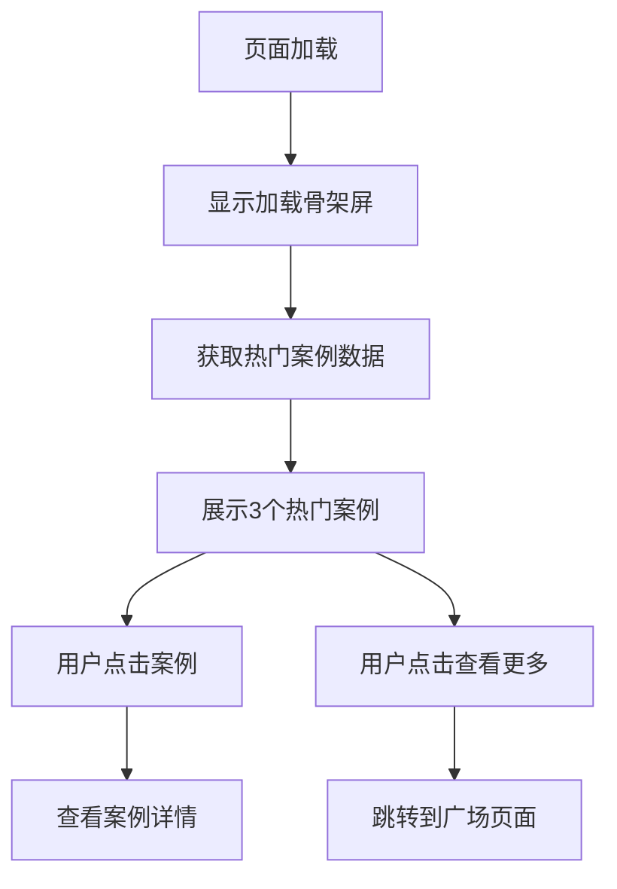

# 首页交互增强设计文档

## 🎯 设计概述

基于用户反馈和产品需求，我们重新设计了首页的交互模式，将核心功能前置，提升用户体验和转化效率。

## 🏗️ 技术架构

### 组件结构
```
DesktopHomePage
├── Navigation (导航栏)
├── HeroSection (Hero区域 + 创建输入)
│   ├── Title & Subtitle
│   ├── CreateInputArea (创建输入区域)
│   │   ├── TextArea (知识点输入框)
│   │   └── ExpandableOptions (可展开的创建选项)
│   └── CardTypeSelection (卡片类型选择)
├── PopularCasesSection (热门案例展示)
│   ├── LoadingSkeletons (加载骨架屏)
│   ├── CaseCards (案例卡片)
│   └── ViewMoreButton (查看更多按钮)
├── StatsSection (数据统计)
└── CTASection (行动召唤)
```

### 状态管理
```typescript
interface HomePageState {
  inputContent: string;           // 用户输入内容
  showCreateOptions: boolean;     // 是否显示创建选项
  popularCases: CaseItem[];       // 热门案例数据
  isLoading: boolean;             // 加载状态
}

interface CaseItem {
  id: number;
  title: string;
  author: string;
  subject: string;
  grade: string;
  description: string;
  thumbnail: string;
  likes: number;
  uses: number;
  rating: number;
  tags: string[];
}
```

## 🎨 UI/UX 设计

### 1. 创建输入区域设计

#### 视觉设计
- **背景**: 半透明白色 + 毛玻璃效果
- **边框**: 聚焦时显示主色调边框
- **布局**: 居中卡片式布局，最大宽度800px
- **动画**: 平滑的展开/收起动画

#### 交互设计
- **输入触发**: 用户开始输入时自动展开选项
- **清空收起**: 输入内容清空时自动收起选项
- **字数统计**: 实时显示字数，最大500字
- **提示信息**: 友好的输入提示和帮助文本

#### 技术实现
```typescript
const handleInputChange = (e: React.ChangeEvent<HTMLTextAreaElement>) => {
  const value = e.target.value;
  setInputContent(value);
  setShowCreateOptions(value.trim().length > 0);
};
```

### 2. 卡片类型选择设计

#### 视觉设计
- **布局**: 2x2网格布局
- **卡片**: 圆角卡片 + 图标 + 标题 + 描述
- **悬停效果**: 边框变色 + 轻微上移 + 阴影加深
- **选中状态**: 主色调边框 + 背景色变化

#### 四种卡片类型
1. **可视化卡** 👁️ - 化抽象为"看见"
2. **类比延展卡** 🌟 - 用生活的温度，点亮知识
3. **启发思考卡** 💭 - 抛出一个好问题
4. **互动氛围卡** 🎭 - 让课堂"破冰"

### 3. 热门案例展示设计

#### 数据结构
```typescript
const mockPopularCases = [
  {
    id: 1,
    title: '二次函数的图像与性质',
    author: '张老师',
    subject: '数学',
    grade: '高中',
    description: '通过动态图像展示...',
    thumbnail: '📊',
    likes: 156,
    uses: 89,
    rating: 4.8,
    tags: ['函数', '图像', '可视化']
  }
  // ...
];
```

#### 视觉设计
- **布局**: 3列网格布局，响应式适配
- **卡片**: 现代化卡片设计，包含完整信息
- **加载状态**: 骨架屏动画效果
- **悬停效果**: 卡片上移 + 阴影加深

#### 信息层次
1. **主要信息**: 缩略图 + 标题 + 描述
2. **分类标签**: 学科 + 学段标签
3. **内容标签**: 知识点标签
4. **社交数据**: 点赞数 + 使用数 + 评分
5. **作者信息**: 创作者署名

## 🔄 交互流程

### 创建流程


### 案例浏览流程


## 📱 响应式设计

### 桌面端 (≥1024px)
- 3列案例网格
- 2x2卡片类型网格
- 完整的导航栏
- 800px最大宽度的输入区域

### 平板端 (768px-1023px)
- 2列案例网格
- 2x2卡片类型网格
- 简化的导航栏
- 适配屏幕宽度的输入区域

### 移动端 (<768px)
- 1列案例网格
- 1x4卡片类型网格
- 移动端导航栏
- 全宽输入区域

## 🎭 动画设计

### 1. 展开/收起动画
```css
.expand-section {
  max-height: 0;
  overflow: hidden;
  transition: all 0.3s ease-in-out;
  opacity: 0;
}

.expand-section.expanded {
  max-height: 400px;
  opacity: 1;
}
```

### 2. 卡片悬停动画
```css
.case-card {
  transition: all var(--transition-base);
}

.case-card:hover {
  transform: translateY(-4px);
  box-shadow: var(--shadow-xl);
}
```

### 3. 加载骨架屏动画
```css
@keyframes loading {
  0% { background-position: 200% 0; }
  100% { background-position: -200% 0; }
}

.skeleton {
  background: linear-gradient(90deg, 
    var(--gray-200) 25%, 
    var(--gray-100) 50%, 
    var(--gray-200) 75%);
  background-size: 200% 100%;
  animation: loading 1.5s infinite;
}
```

## 🔧 性能优化

### 1. 数据加载优化
- **懒加载**: 案例数据按需加载
- **缓存策略**: 热门案例数据缓存
- **错误处理**: 优雅的错误降级

### 2. 渲染优化
- **虚拟化**: 大量数据时使用虚拟滚动
- **防抖**: 输入框防抖处理
- **预加载**: 关键资源预加载

### 3. 交互优化
- **即时反馈**: 所有操作都有即时视觉反馈
- **加载状态**: 明确的加载指示器
- **错误提示**: 友好的错误信息

## 🧪 测试策略

### 功能测试
- [ ] 输入框交互正常
- [ ] 创建选项展开/收起
- [ ] 案例数据加载显示
- [ ] 页面跳转功能
- [ ] 响应式布局适配

### 性能测试
- [ ] 首屏加载时间 < 2s
- [ ] 交互响应时间 < 200ms
- [ ] 内存使用合理
- [ ] 动画流畅度 60fps

### 用户体验测试
- [ ] 操作流程直观
- [ ] 视觉层次清晰
- [ ] 错误处理友好
- [ ] 无障碍功能支持

## 📊 数据埋点

### 关键指标
- **输入框使用率**: 用户输入内容的比例
- **创建转化率**: 从输入到创建的转化
- **案例点击率**: 热门案例的点击率
- **页面停留时间**: 用户在首页的停留时间

### 埋点事件
```typescript
// 输入框交互
trackEvent('homepage_input_start', { timestamp, userId });
trackEvent('homepage_input_expand', { contentLength, timestamp });

// 案例交互
trackEvent('homepage_case_click', { caseId, position, timestamp });
trackEvent('homepage_view_more_click', { timestamp });

// 创建交互
trackEvent('homepage_card_type_select', { cardType, timestamp });
trackEvent('homepage_create_start', { cardType, contentLength });
```

## 🚀 未来优化方向

### 短期优化 (1-2周)
- 添加输入内容的智能提示
- 优化加载性能和动画效果
- 完善错误处理和边界情况

### 中期优化 (1-2月)
- 个性化案例推荐
- 输入内容的AI预处理
- 更丰富的交互动画

### 长期优化 (3-6月)
- 智能创建建议
- 协作功能集成
- 高级个性化定制

---

**设计版本**: v1.0  
**创建日期**: 2025-01-16  
**设计师**: AI Assistant  
**开发状态**: 待实现