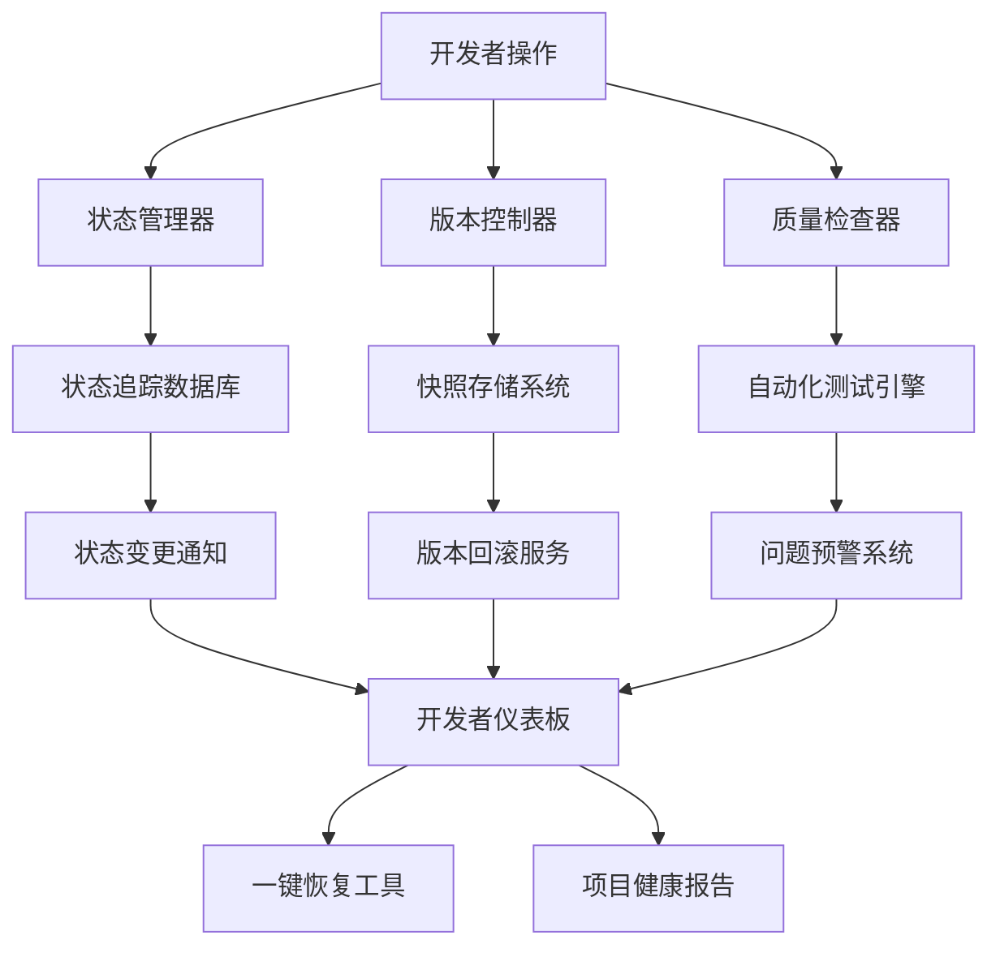
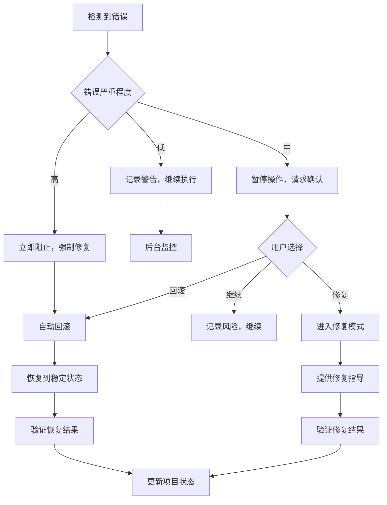

# Design Document

## Overview

本设计文档提供了一套完整的项目管理规则增强系统，通过建立自动化的状态管理、版本控制、质量检查和恢复机制，解决开发过程中的混乱问题。系统采用多层防护策略，从预防、检测到恢复，全方位保障项目开发的稳定性。

## Architecture

### 核心组件架构



### 数据流设计

1. **状态管理流程**：开发者操作 → 状态验证 → 状态更新 → 变更记录 → 通知反馈
2. **版本控制流程**：文件变更 → 自动快照 → 版本标记 → 影响分析 → 回滚准备
3. **质量检查流程**：代码提交 → 自动测试 → 问题检测 → 预警通知 → 修复建议

## Components and Interfaces

### 1. 项目状态管理系统

**核心文件：** `.kiro/project-state/`

```typescript
interface ProjectState {
  features: {
    [featureName: string]: {
      status: 'not_started' | 'in_progress' | 'completed' | 'testing' | 'deployed';
      lastUpdated: Date;
      completionCriteria: string[];
      dependencies: string[];
      riskLevel: 'low' | 'medium' | 'high';
    }
  };
  globalHealth: {
    overallStatus: 'stable' | 'warning' | 'critical';
    lastStableSnapshot: string;
    activeIssues: Issue[];
  };
}
```

**关键功能：**
- 自动状态验证和变更记录
- 功能依赖关系管理
- 状态回退预警机制
- 项目健康度评估

### 2. 样式版本管理系统

**核心文件：** `.kiro/style-snapshots/`

```typescript
interface StyleSnapshot {
  id: string;
  timestamp: Date;
  files: {
    [filePath: string]: {
      content: string;
      hash: string;
    }
  };
  pageScreenshots: {
    [pagePath: string]: string; // base64 screenshot
  };
  isStable: boolean;
  tags: string[];
}
```

**关键功能：**
- 自动样式文件快照
- 页面视觉回归检测
- 一键样式回滚
- 样式影响范围分析

### 3. 开发流程规范引擎

**核心文件：** `.kiro/workflow-rules/`

```typescript
interface WorkflowRule {
  id: string;
  name: string;
  trigger: 'before_code_change' | 'after_code_change' | 'before_commit' | 'status_change';
  conditions: Condition[];
  actions: Action[];
  severity: 'info' | 'warning' | 'error' | 'blocking';
}

interface PreCommitChecklist {
  runExistingTests: boolean;
  checkStyleConsistency: boolean;
  validateFeatureStatus: boolean;
  updateDocumentation: boolean;
  verifyDependencies: boolean;
}
```

**关键功能：**
- 强制性开发流程检查
- 自动化预提交验证
- 开发阶段门控机制
- 流程合规性报告

### 4. 自动化质量检查系统

**核心文件：** `.kiro/quality-checks/`

```typescript
interface QualityCheck {
  type: 'code_quality' | 'style_regression' | 'functional_test' | 'dependency_check';
  status: 'passed' | 'failed' | 'warning';
  details: {
    issues: QualityIssue[];
    suggestions: string[];
    autoFixAvailable: boolean;
  };
  timestamp: Date;
}
```

**关键功能：**
- 实时代码质量监控
- 自动化视觉回归测试
- 功能完整性验证
- 智能修复建议

### 5. 项目恢复系统

**核心文件：** `.kiro/recovery-points/`

```typescript
interface RecoveryPoint {
  id: string;
  name: string;
  timestamp: Date;
  projectState: ProjectState;
  codeSnapshot: string;
  styleSnapshot: string;
  isAutomatic: boolean;
  recoveryInstructions: string[];
}
```

**关键功能：**
- 自动恢复点创建
- 选择性功能恢复
- 智能回滚策略
- 恢复操作审计

## Data Models

### 项目状态数据模型

```json
{
  "projectState": {
    "version": "1.0.0",
    "lastUpdated": "2024-01-15T10:30:00Z",
    "features": {
      "homepage": {
        "status": "completed",
        "completionDate": "2024-01-14T15:20:00Z",
        "completionCriteria": [
          "UI样式完整",
          "响应式设计正常",
          "所有链接可用",
          "性能测试通过"
        ],
        "riskLevel": "low",
        "lastStableVersion": "snapshot_20240114_1520"
      },
      "create-page": {
        "status": "in_progress",
        "startDate": "2024-01-15T09:00:00Z",
        "completionCriteria": [
          "AI功能集成",
          "用户界面完成",
          "数据验证实现"
        ],
        "riskLevel": "medium",
        "blockers": ["AI API集成待完成"]
      }
    }
  }
}
```

### 样式快照数据模型

```json
{
  "styleSnapshot": {
    "id": "snapshot_20240115_1030",
    "timestamp": "2024-01-15T10:30:00Z",
    "isStable": true,
    "files": {
      "src/app/globals.css": {
        "hash": "abc123def456",
        "size": 2048,
        "lastModified": "2024-01-15T10:25:00Z"
      },
      "src/app/page.tsx": {
        "hash": "def456ghi789",
        "size": 4096,
        "lastModified": "2024-01-15T10:28:00Z"
      }
    },
    "pageScreenshots": {
      "/": "data:image/png;base64,iVBORw0KGgoAAAANSUhEUgAA...",
      "/create": "data:image/png;base64,iVBORw0KGgoAAAANSUhEUgAA..."
    },
    "tags": ["stable", "pre-ai-integration", "ui-complete"]
  }
}
```

## Error Handling

### 错误分类和处理策略

1. **状态不一致错误**
   - 检测：自动状态验证
   - 处理：强制状态同步或回滚
   - 预防：状态变更前置检查

2. **样式回归错误**
   - 检测：视觉差异对比
   - 处理：自动回滚到最近稳定版本
   - 预防：样式变更影响分析

3. **功能破坏错误**
   - 检测：自动化功能测试
   - 处理：阻止提交并提供修复建议
   - 预防：预提交功能验证

4. **依赖冲突错误**
   - 检测：依赖关系分析
   - 处理：智能依赖解决方案
   - 预防：依赖变更影响评估

### 错误恢复流程



## Testing Strategy

### 1. 自动化测试层级

**单元测试**
- 状态管理逻辑测试
- 版本控制功能测试
- 质量检查算法测试

**集成测试**
- 工作流程端到端测试
- 系统组件交互测试
- 恢复机制完整性测试

**视觉回归测试**
- 页面截图对比
- 样式一致性验证
- 响应式设计测试

### 2. 测试自动化策略

```typescript
interface TestSuite {
  preCommitTests: {
    codeQuality: boolean;
    functionalTests: boolean;
    styleRegression: boolean;
    dependencyCheck: boolean;
  };
  continuousTests: {
    statusConsistency: boolean;
    performanceMonitoring: boolean;
    securityScanning: boolean;
  };
  recoveryTests: {
    rollbackFunctionality: boolean;
    dataIntegrity: boolean;
    systemStability: boolean;
  };
}
```

### 3. 测试数据管理

- **测试快照管理**：自动创建和维护测试用例快照
- **测试环境隔离**：确保测试不影响生产数据
- **测试结果追踪**：详细记录测试历史和趋势分析

## Implementation Considerations

### 技术栈选择

- **状态管理**：JSON文件 + TypeScript接口
- **快照存储**：本地文件系统 + 压缩算法
- **自动化测试**：Jest + Playwright + 自定义脚本
- **视觉回归**：Playwright + 图像对比算法
- **通知系统**：控制台输出 + 文件日志

### 性能优化

- **增量快照**：只存储变更部分
- **异步处理**：后台执行耗时操作
- **缓存机制**：缓存频繁访问的数据
- **压缩存储**：减少存储空间占用

### 安全考虑

- **数据加密**：敏感信息加密存储
- **访问控制**：操作权限验证
- **审计日志**：完整的操作记录
- **备份策略**：多重备份保护