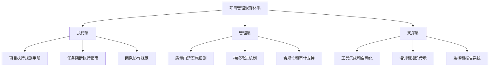

# 项目管理规则指导文档补充设计

## 概述

本设计文档基于需求分析，为项目管理规则指导文档补充提供详细的架构设计和实施方案。设计目标是创建一个完整、可操作、可持续的项目管理规则体系。

## 架构设计

### 整体架构



### 文档架构设计

```
项目管理规则文档体系
├── 📋 核心执行文档
│   ├── PROJECT_EXECUTION_RULES_HANDBOOK.md     # 项目执行规则手册
│   ├── TASK_BLOCKING_EXECUTION_GUIDE.md       # 任务阻断执行指南
│   └── TEAM_COLLABORATION_STANDARDS.md        # 团队协作规范
│
├── 🔧 管理控制文档
│   ├── QUALITY_GATE_IMPLEMENTATION_GUIDE.md   # 质量门禁实施细则
│   ├── CONTINUOUS_IMPROVEMENT_MECHANISM.md    # 持续改进机制
│   └── COMPLIANCE_AND_AUDIT_SUPPORT.md        # 合规性和审计支持
│
├── 🛠️ 支撑工具文档
│   ├── TOOLS_INTEGRATION_AUTOMATION.md        # 工具集成和自动化
│   ├── TRAINING_KNOWLEDGE_TRANSFER.md         # 培训和知识传承
│   └── MONITORING_REPORTING_SYSTEM.md         # 监控和报告系统
│
├── 📊 配置和模板
│   ├── configs/                               # 配置文件集合
│   ├── templates/                             # 模板文件集合
│   ├── scripts/                               # 自动化脚本集合
│   └── checklists/                            # 检查清单集合
│
└── 📈 监控和度量
    ├── dashboards/                            # 监控面板
    ├── reports/                               # 报告模板
    └── metrics/                               # 度量指标定义
```

## 通用开发指导原则

### 核心开发哲学

#### 基本原则
**"技术服务于用户，而非相反"**

所有技术决策都应该以用户价值为导向，而不是以技术完美性为目标。

#### 开发优先级金字塔

```
           🔴 用户核心价值 (最高优先级)
          ────────────────────────
         🟠 基本功能可用性
        ──────────────────
       🟡 用户体验优化
      ────────────────
     🟢 系统稳定性
    ──────────────
   🔵 性能优化
  ────────────
 🟣 高级特性
──────────
```

#### 五大核心规则

##### 规则1: "先让它工作，再让它完美" (Make It Work First)
- 任何新功能都必须先有最简可用版本
- 复杂功能必须分阶段实现
- 每个阶段都要验证基本功能正常
- 不要一次性引入过多复杂度

##### 规则2: "状态透明化" (Transparent Status)
- 完成操作后立即给出明确结论
- 避免不必要的工具调用延长等待时间
- 让用户能清楚判断当前状态
- 提供有意义的进度反馈

##### 规则3: "测试金字塔正向构建" (Right-Side-Up Testing Pyramid)
- 冒烟测试 (确保基本功能工作) - 优先级1
- 集成测试 (确保模块协作) - 优先级2
- 单元测试 (确保代码质量) - 优先级3

##### 规则4: "渐进式复杂度" (Progressive Complexity)
- 每个开发阶段只引入必要的复杂度
- 新功能必须在现有功能稳定的基础上添加
- 复杂功能必须有降级方案
- 始终保持系统的可用性

##### 规则5: "真实环境验证" (Real Environment Validation)
- 任何功能开发完成后，必须在真实环境测试
- 测试不能完全依赖mock，要有端到端验证
- 部署前必须有完整的冒烟测试
- 定期在生产环境进行健康检查

#### 危险信号识别系统

##### 立即停止开发的红色信号
- 基本功能不工作，但有大量高级功能
- 测试覆盖率很高，但实际运行有问题
- 架构很完美，但用户无法使用
- 开发时间超过预期100%以上
- 需要复杂配置才能运行

##### 需要重新评估的黄色信号
- 新功能导致现有功能失效
- 复杂度增长超过价值增长
- 需要大量文档才能理解如何使用
- 测试需要复杂的mock才能通过
- 团队成员对系统理解不一致

## 组件设计

### 1. 项目执行规则手册

#### 设计目标
- 提供统一的项目执行标准
- 整合两套改进措施为一体化规则
- 确保任务状态管理的严格执行

#### 核心组件
```markdown
1. 执行规则总纲
   - 核心原则和价值观
   - 执行流程概览
   - 角色和职责定义

2. 任务执行标准流程
   - 任务启动检查清单
   - 执行阶段管理规则
   - 完成验收标准

3. 状态管理强制规则
   - 8种状态的严格定义
   - 状态转换的强制条件
   - 阻断状态的处理规则

4. 质量标准分级体系
   - Level 1 (MVP): 70%质量标准
   - Level 2 (标准): 85%质量标准
   - Level 3 (企业): 95%质量标准

5. 风险管理和时间控制
   - 风险识别和评估方法
   - 时间缓冲和调整机制
   - 应急处理预案
```

#### 实施特性
- **强制执行**: 通过工具和流程强制执行规则
- **自动检查**: 自动验证规则遵循情况
- **实时反馈**: 提供实时的规则执行反馈
- **持续优化**: 基于执行数据持续优化规则

### 2. 任务阻断执行指南

#### 设计目标
- 提供标准化的问题识别和处理流程
- 确保阻断机制的有效执行
- 建立问题解决的最佳实践

#### 核心组件
```markdown
1. 问题识别和分类系统
   - 问题类型分类标准
   - 严重程度评估矩阵
   - 影响范围分析方法

2. 阻断操作标准流程
   - 立即阻断操作步骤
   - 问题记录和通知机制
   - 资源调配和协调流程

3. 问题解决执行指南
   - 根因分析方法
   - 解决方案设计原则
   - 修复验证标准

4. 阻断解除验证流程
   - 解除条件检查清单
   - 验证测试要求
   - 同行评审标准

5. 升级和协调机制
   - 问题升级触发条件
   - 跨团队协调流程
   - 管理层介入机制
```

#### 工具集成
- **自动检测**: 集成CI/CD自动检测问题
- **即时通知**: 问题发现后立即通知相关人员
- **状态跟踪**: 实时跟踪问题处理进展
- **效果评估**: 评估阻断和解决效果

### 3. 质量门禁实施细则

#### 设计目标
- 建立自动化的质量保障体系
- 提供分级的质量标准配置
- 确保质量门禁的有效执行

#### 核心组件
```markdown
1. 质量门禁架构设计
   - 5层质量检查体系
   - 门禁触发条件定义
   - 阻断和通过机制

2. 分级质量标准配置
   - MVP级别质量配置
   - 标准级别质量配置
   - 企业级别质量配置

3. 自动化检查实施
   - 代码质量检查配置
   - 测试覆盖率检查配置
   - 安全扫描配置
   - 性能测试配置

4. 质量报告和分析
   - 实时质量监控面板
   - 质量趋势分析报告
   - 质量问题统计分析

5. 质量改进反馈循环
   - 质量问题根因分析
   - 改进措施制定和跟踪
   - 质量标准持续优化
```

#### 技术实现
```yaml
# 质量门禁配置示例
quality_gates:
  mvp_level:
    code_coverage: 70%
    test_pass_rate: 100%
    security_scan: "no_high_vulnerabilities"
    performance_regression: 20%
    
  standard_level:
    code_coverage: 85%
    test_pass_rate: 100%
    security_scan: "no_medium_high_vulnerabilities"
    performance_regression: 10%
    
  enterprise_level:
    code_coverage: 95%
    test_pass_rate: 100%
    security_scan: "no_vulnerabilities"
    performance_regression: 5%
```

### 4. 团队协作规范

#### 设计目标
- 建立基于新状态管理的协作流程
- 提高团队沟通效率和协作质量
- 确保信息透明和及时共享

#### 核心组件
```markdown
1. 协作流程标准化
   - 任务分配和接收流程
   - 状态变更通知机制
   - 问题协作解决流程

2. 沟通规范和模板
   - 状态更新沟通模板
   - 问题报告沟通模板
   - 协作请求沟通模板

3. 会议和评审机制
   - 每日站会规范
   - 阶段评审流程
   - 问题解决会议机制

4. 知识分享和传承
   - 经验分享机制
   - 最佳实践收集
   - 知识库维护流程

5. 冲突解决和协调
   - 冲突识别和分类
   - 协调和仲裁机制
   - 升级处理流程
```

### 5. 持续改进机制

#### 设计目标
- 建立数据驱动的改进体系
- 实现流程的持续优化
- 建立改进效果的量化评估

#### 核心组件
```markdown
1. 数据收集和分析系统
   - 项目执行数据收集
   - 质量指标监控分析
   - 团队反馈收集分析

2. 改进机会识别机制
   - 问题模式识别
   - 瓶颈分析方法
   - 改进优先级评估

3. 改进措施设计和实施
   - 改进方案设计原则
   - 试点验证机制
   - 全面推广流程

4. 改进效果评估体系
   - 效果评估指标定义
   - 评估方法和工具
   - 改进ROI计算

5. 知识管理和传承
   - 改进经验总结
   - 最佳实践库建设
   - 知识传承机制
```

## 数据模型设计

### 项目执行数据模型
```typescript
interface ProjectExecution {
  projectId: string;
  taskId: string;
  status: TaskStatus;
  qualityLevel: QualityLevel;
  executionPhase: ExecutionPhase;
  startTime: Date;
  endTime?: Date;
  blockedTime?: number;
  qualityMetrics: QualityMetrics;
  riskFactors: RiskFactor[];
}

interface TaskStatus {
  current: StatusType;
  history: StatusChange[];
  blockedReasons?: string[];
  resolutionActions?: string[];
}

interface QualityMetrics {
  codeCoverage: number;
  testPassRate: number;
  securityScore: number;
  performanceScore: number;
  documentationScore: number;
}
```

### 问题跟踪数据模型
```typescript
interface IssueTracking {
  issueId: string;
  taskId: string;
  severity: IssueSeverity;
  category: IssueCategory;
  description: string;
  discoveredAt: Date;
  discoveredBy: string;
  blockedTasks: string[];
  resolutionPlan: ResolutionPlan;
  status: IssueStatus;
  resolvedAt?: Date;
  verifiedAt?: Date;
}

interface ResolutionPlan {
  rootCause: string;
  solution: string;
  estimatedTime: number;
  assignedTo: string;
  dependencies: string[];
  riskAssessment: string;
}
```

## 错误处理设计

### 错误分类和处理策略
```markdown
1. 系统错误
   - 工具配置错误
   - 自动化流程失败
   - 数据同步问题

2. 流程错误
   - 规则违反
   - 状态转换错误
   - 质量门禁失败

3. 人为错误
   - 操作失误
   - 理解偏差
   - 沟通不当

4. 环境错误
   - 依赖问题
   - 资源不足
   - 外部服务故障
```

### 错误恢复机制
```markdown
1. 自动恢复
   - 重试机制
   - 回滚操作
   - 备用方案

2. 半自动恢复
   - 问题诊断
   - 修复建议
   - 人工确认

3. 手动恢复
   - 详细诊断
   - 专家支持
   - 定制解决方案
```

## 测试策略

### 测试层次设计
```markdown
1. 单元测试
   - 规则验证逻辑测试
   - 数据模型测试
   - 工具函数测试

2. 集成测试
   - 工具集成测试
   - 流程集成测试
   - 数据流测试

3. 系统测试
   - 端到端流程测试
   - 性能测试
   - 可靠性测试

4. 用户验收测试
   - 用户场景测试
   - 可用性测试
   - 满意度测试
```

### 测试自动化
```markdown
1. 规则执行测试
   - 自动验证规则遵循情况
   - 状态转换测试
   - 质量门禁测试

2. 工具集成测试
   - CI/CD集成测试
   - 监控系统测试
   - 通知系统测试

3. 性能和负载测试
   - 大规模项目测试
   - 并发操作测试
   - 资源使用测试
```

## 部署和运维设计

### 部署策略
```markdown
1. 分阶段部署
   - 试点团队部署
   - 逐步扩展部署
   - 全面推广部署

2. 配置管理
   - 环境配置分离
   - 版本控制管理
   - 配置变更跟踪

3. 监控和告警
   - 实时监控系统
   - 异常告警机制
   - 性能监控面板
```

### 运维支持
```markdown
1. 日常运维
   - 系统健康检查
   - 数据备份恢复
   - 性能优化调整

2. 问题处理
   - 故障快速响应
   - 问题根因分析
   - 解决方案实施

3. 持续改进
   - 运维数据分析
   - 系统优化建议
   - 工具升级维护
```

---

**设计版本**: v1.0  
**设计日期**: 2024年1月29日  
**适用范围**: 项目管理规则指导文档补充  
**维护责任**: 项目管理和技术团队