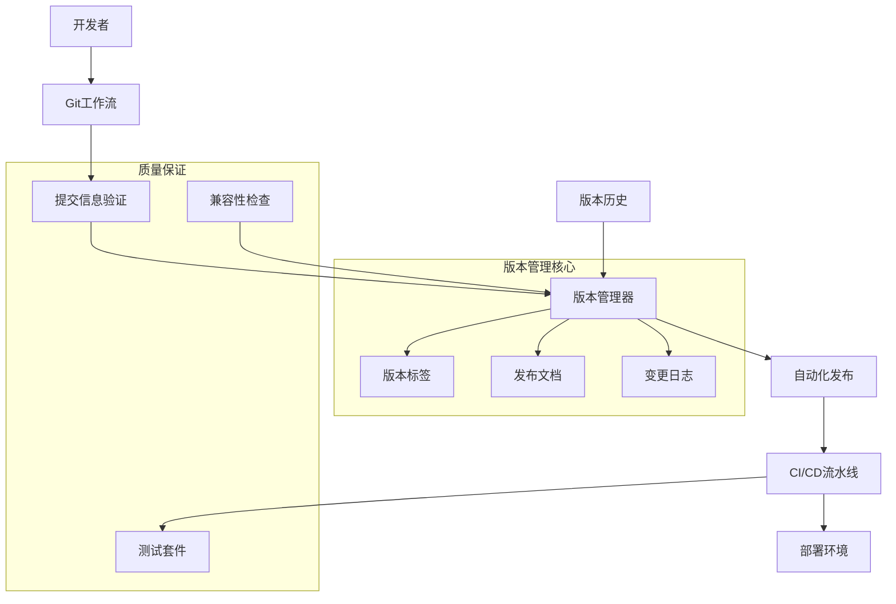

# 版本管理系统设计文档

## 概述

本文档描述了Inspi AI Platform项目的版本管理系统设计，该系统基于语义化版本控制（SemVer）规范，集成了自动化发布流程、Git工作流管理、提交信息规范化和CI/CD集成等功能。

## 架构

### 系统架构图



### 技术栈选择

- **版本管理工具**: `standard-version` / `semantic-release`
- **提交信息规范**: Conventional Commits
- **Git工作流**: GitFlow简化版
- **CI/CD平台**: GitHub Actions
- **包管理器**: pnpm
- **文档生成**: 自定义脚本 + 模板

## 组件和接口

### 1. 版本管理器 (VersionManager)

```typescript
interface VersionManager {
  // 版本操作
  getCurrentVersion(): Promise<string>
  bumpVersion(type: 'major' | 'minor' | 'patch' | 'prerelease'): Promise<string>
  createTag(version: string, message: string): Promise<void>
  
  // 发布管理
  createRelease(version: string): Promise<ReleaseInfo>
  generateChangelog(fromVersion?: string, toVersion?: string): Promise<string>
  
  // 兼容性检查
  checkCompatibility(fromVersion: string, toVersion: string): Promise<CompatibilityReport>
}

interface ReleaseInfo {
  version: string
  tag: string
  date: Date
  changes: ChangeEntry[]
  breakingChanges: BreakingChange[]
  migrationGuide?: string
}

interface ChangeEntry {
  type: 'feat' | 'fix' | 'docs' | 'style' | 'refactor' | 'test' | 'chore'
  scope?: string
  description: string
  hash: string
  references: string[]
}

interface BreakingChange {
  description: string
  migration: string
  affectedAPIs: string[]
}
```

### 2. Git工作流管理器 (GitFlowManager)

```typescript
interface GitFlowManager {
  // 分支管理
  createFeatureBranch(name: string): Promise<void>
  createHotfixBranch(name: string): Promise<void>
  createReleaseBranch(version: string): Promise<void>
  
  // 合并管理
  mergeFeature(branchName: string): Promise<void>
  mergeHotfix(branchName: string): Promise<void>
  finishRelease(version: string): Promise<void>
  
  // 状态检查
  getCurrentBranch(): Promise<string>
  getUnmergedBranches(): Promise<string[]>
  checkWorkingDirectory(): Promise<GitStatus>
}

interface GitStatus {
  clean: boolean
  staged: string[]
  modified: string[]
  untracked: string[]
  ahead: number
  behind: number
}
```

### 3. 提交信息验证器 (CommitValidator)

```typescript
interface CommitValidator {
  validateMessage(message: string): ValidationResult
  formatMessage(type: string, scope: string, description: string): string
  parseMessage(message: string): ParsedCommit
  
  // 钩子集成
  installGitHooks(): Promise<void>
  uninstallGitHooks(): Promise<void>
}

interface ValidationResult {
  valid: boolean
  errors: string[]
  warnings: string[]
  suggestions: string[]
}

interface ParsedCommit {
  type: string
  scope?: string
  description: string
  body?: string
  footer?: string
  breaking: boolean
  references: string[]
}
```

### 4. 发布文档生成器 (ReleaseDocGenerator)

```typescript
interface ReleaseDocGenerator {
  generateReleaseNotes(version: string, changes: ChangeEntry[]): Promise<string>
  generateChangelog(releases: ReleaseInfo[]): Promise<string>
  generateMigrationGuide(breakingChanges: BreakingChange[]): Promise<string>
  
  // 模板管理
  loadTemplate(type: 'release' | 'changelog' | 'migration'): Promise<string>
  customizeTemplate(type: string, template: string): Promise<void>
}
```

### 5. CI/CD集成器 (CIIntegrator)

```typescript
interface CIIntegrator {
  // 触发器管理
  onTagCreated(callback: (tag: string) => Promise<void>): void
  onReleaseCreated(callback: (release: ReleaseInfo) => Promise<void>): void
  
  // 部署管理
  deployToStaging(version: string): Promise<DeploymentResult>
  deployToProduction(version: string): Promise<DeploymentResult>
  rollback(version: string): Promise<DeploymentResult>
  
  // 状态监控
  getDeploymentStatus(version: string): Promise<DeploymentStatus>
  getEnvironmentHealth(env: 'staging' | 'production'): Promise<HealthStatus>
}

interface DeploymentResult {
  success: boolean
  version: string
  environment: string
  url?: string
  logs: string[]
  duration: number
}
```

## 数据模型

### 版本信息模型

```typescript
interface Version {
  major: number
  minor: number
  patch: number
  prerelease?: string
  build?: string
  
  toString(): string
  compare(other: Version): number
  isCompatible(other: Version): boolean
}

interface VersionHistory {
  versions: VersionRecord[]
  currentVersion: string
  latestStable: string
  
  getVersion(version: string): VersionRecord | null
  getVersionsSince(version: string): VersionRecord[]
  getVersionsBetween(from: string, to: string): VersionRecord[]
}

interface VersionRecord {
  version: string
  tag: string
  date: Date
  author: string
  message: string
  changes: ChangeEntry[]
  assets: ReleaseAsset[]
  deprecated: boolean
  securityFixes: boolean
}
```

### 配置模型

```typescript
interface VersionConfig {
  // 版本策略
  strategy: 'semantic' | 'calendar' | 'custom'
  prereleaseIdentifier: string
  tagPrefix: string
  
  // 自动化设置
  autoTag: boolean
  autoRelease: boolean
  autoChangelog: boolean
  
  // 分支配置
  mainBranch: string
  developBranch: string
  releaseBranchPrefix: string
  hotfixBranchPrefix: string
  featureBranchPrefix: string
  
  // 提交规范
  commitTypes: CommitType[]
  scopes: string[]
  requireScope: boolean
  
  // 发布配置
  releaseAssets: string[]
  releaseTemplate: string
  changelogTemplate: string
}

interface CommitType {
  type: string
  description: string
  emoji?: string
  bump: 'major' | 'minor' | 'patch' | 'none'
  changelog: boolean
}
```

## 错误处理

### 错误类型定义

```typescript
abstract class VersionError extends Error {
  abstract code: string
  abstract category: 'validation' | 'git' | 'release' | 'deployment'
}

class InvalidVersionError extends VersionError {
  code = 'INVALID_VERSION'
  category = 'validation' as const
}

class GitOperationError extends VersionError {
  code = 'GIT_OPERATION_FAILED'
  category = 'git' as const
  
  constructor(message: string, public operation: string, public exitCode: number) {
    super(message)
  }
}

class ReleaseError extends VersionError {
  code = 'RELEASE_FAILED'
  category = 'release' as const
}

class DeploymentError extends VersionError {
  code = 'DEPLOYMENT_FAILED'
  category = 'deployment' as const
  
  constructor(message: string, public environment: string, public version: string) {
    super(message)
  }
}
```

### 错误处理策略

1. **验证错误**: 提供详细的错误信息和修复建议
2. **Git操作错误**: 自动重试机制，失败后提供手动修复指导
3. **发布错误**: 支持部分回滚和重新发布
4. **部署错误**: 自动回滚到上一个稳定版本

## 测试策略

### 单元测试

```typescript
describe('VersionManager', () => {
  describe('bumpVersion', () => {
    it('should increment patch version for bug fixes', async () => {
      const manager = new VersionManager()
      const newVersion = await manager.bumpVersion('patch')
      expect(newVersion).toMatch(/^\d+\.\d+\.\d+$/)
    })
    
    it('should increment minor version for new features', async () => {
      const manager = new VersionManager()
      const newVersion = await manager.bumpVersion('minor')
      expect(newVersion).toMatch(/^\d+\.\d+\.0$/)
    })
    
    it('should increment major version for breaking changes', async () => {
      const manager = new VersionManager()
      const newVersion = await manager.bumpVersion('major')
      expect(newVersion).toMatch(/^\d+\.0\.0$/)
    })
  })
})
```

### 集成测试

```typescript
describe('Version Release Flow', () => {
  it('should complete full release cycle', async () => {
    // 1. 创建功能分支
    await gitFlow.createFeatureBranch('test-feature')
    
    // 2. 提交变更
    await git.commit('feat: add test feature')
    
    // 3. 合并到主分支
    await gitFlow.mergeFeature('test-feature')
    
    // 4. 创建版本
    const version = await versionManager.bumpVersion('minor')
    
    // 5. 验证标签创建
    const tags = await git.getTags()
    expect(tags).toContain(`v${version}`)
    
    // 6. 验证发布文档
    const releaseNotes = await fs.readFile(`RELEASE_NOTES_v${version}.md`)
    expect(releaseNotes).toContain('test feature')
  })
})
```

### 端到端测试

```typescript
describe('CI/CD Integration', () => {
  it('should trigger deployment on version tag', async () => {
    // 模拟标签创建
    await git.createTag('v1.2.3', 'Release v1.2.3')
    
    // 等待CI触发
    await waitForCI()
    
    // 验证部署状态
    const deployment = await ci.getDeploymentStatus('v1.2.3')
    expect(deployment.success).toBe(true)
    expect(deployment.environment).toBe('production')
  })
})
```

## 性能考虑

### 优化策略

1. **增量变更日志生成**: 只处理自上次发布以来的提交
2. **并行处理**: 同时进行文档生成和资产构建
3. **缓存机制**: 缓存Git操作结果和模板渲染
4. **懒加载**: 按需加载版本历史和变更信息

### 性能指标

- 版本创建时间: < 30秒
- 发布文档生成: < 10秒
- Git操作响应: < 5秒
- CI触发延迟: < 2分钟

## 安全考虑

### 访问控制

1. **分支保护**: 主分支需要PR审查
2. **标签保护**: 只有维护者可以创建版本标签
3. **部署权限**: 生产部署需要额外授权
4. **密钥管理**: 使用GitHub Secrets管理敏感信息

### 审计日志

```typescript
interface AuditLog {
  timestamp: Date
  user: string
  action: 'version_bump' | 'tag_create' | 'release_publish' | 'deployment'
  details: Record<string, any>
  result: 'success' | 'failure'
  error?: string
}
```

## 监控和告警

### 关键指标

1. **发布频率**: 每周/月发布次数
2. **发布成功率**: 成功发布占比
3. **回滚频率**: 需要回滚的发布占比
4. **部署时间**: 从标签创建到部署完成的时间

### 告警规则

1. **发布失败**: 立即通知维护者
2. **部署超时**: 超过预期时间告警
3. **健康检查失败**: 部署后验证失败告警
4. **安全漏洞**: 依赖扫描发现高危漏洞告警

## 配置管理

### 配置文件结构

```json
{
  "version": {
    "strategy": "semantic",
    "tagPrefix": "v",
    "prereleaseIdentifier": "beta",
    "autoTag": true,
    "autoRelease": true
  },
  "git": {
    "mainBranch": "main",
    "developBranch": "develop",
    "requirePR": true,
    "requireReview": true
  },
  "commit": {
    "types": [
      {"type": "feat", "bump": "minor", "changelog": true},
      {"type": "fix", "bump": "patch", "changelog": true},
      {"type": "docs", "bump": "none", "changelog": false}
    ],
    "scopes": ["ui", "api", "core", "test"],
    "requireScope": false
  },
  "release": {
    "generateNotes": true,
    "includeAssets": ["dist/", "docs/"],
    "notifyChannels": ["#releases"]
  },
  "deployment": {
    "staging": {
      "auto": true,
      "branch": "develop"
    },
    "production": {
      "auto": false,
      "branch": "main",
      "requireApproval": true
    }
  }
}
```

## 迁移计划

### 从当前状态迁移

1. **阶段1**: 安装和配置工具
   - 安装standard-version或semantic-release
   - 配置提交信息验证
   - 设置Git钩子

2. **阶段2**: 规范化现有版本
   - 分析现有提交历史
   - 创建初始变更日志
   - 标准化版本标签

3. **阶段3**: 集成CI/CD
   - 更新GitHub Actions工作流
   - 配置自动部署触发器
   - 设置监控和告警

4. **阶段4**: 团队培训
   - 提供工具使用指南
   - 培训新的工作流程
   - 建立最佳实践文档

### 风险缓解

1. **备份策略**: 迁移前完整备份代码库
2. **渐进式部署**: 先在开发环境验证
3. **回滚计划**: 准备快速回到原有流程的方案
4. **监控加强**: 迁移期间加强监控和日志记录