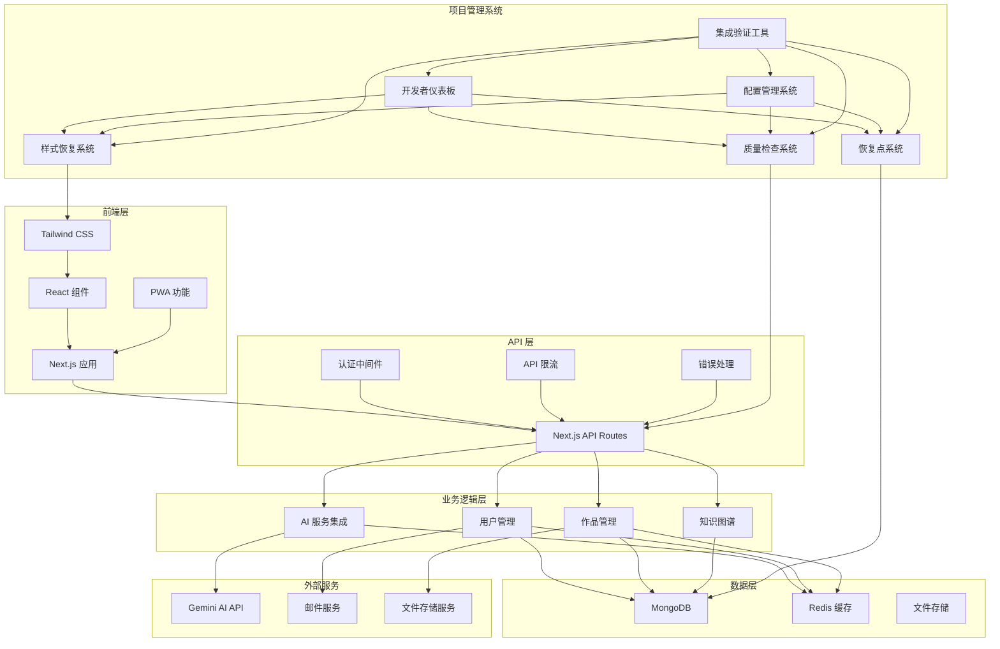
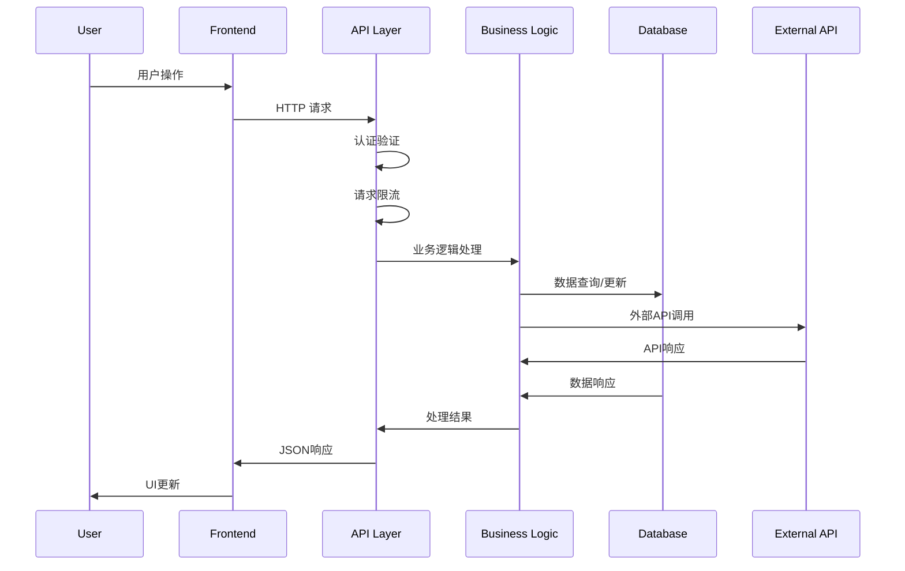
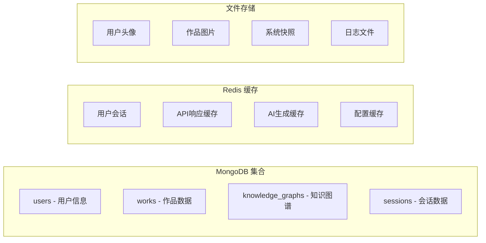
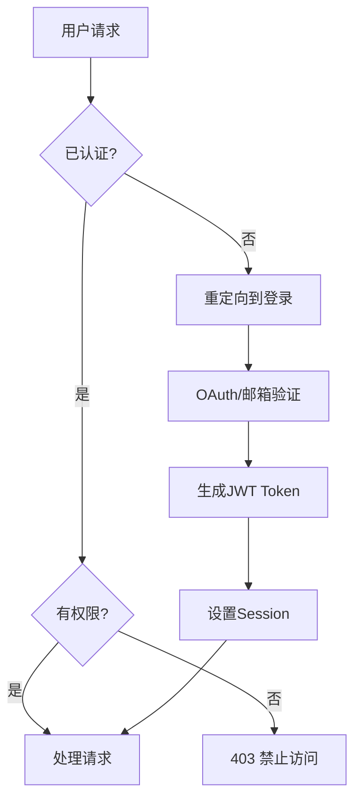
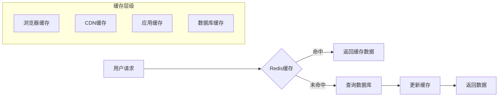
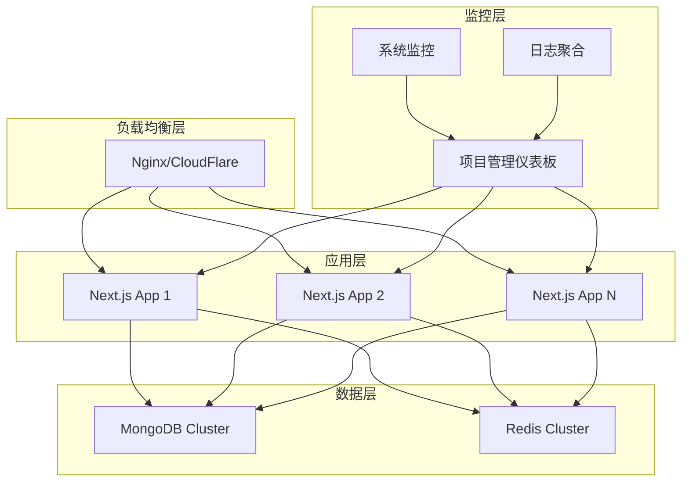
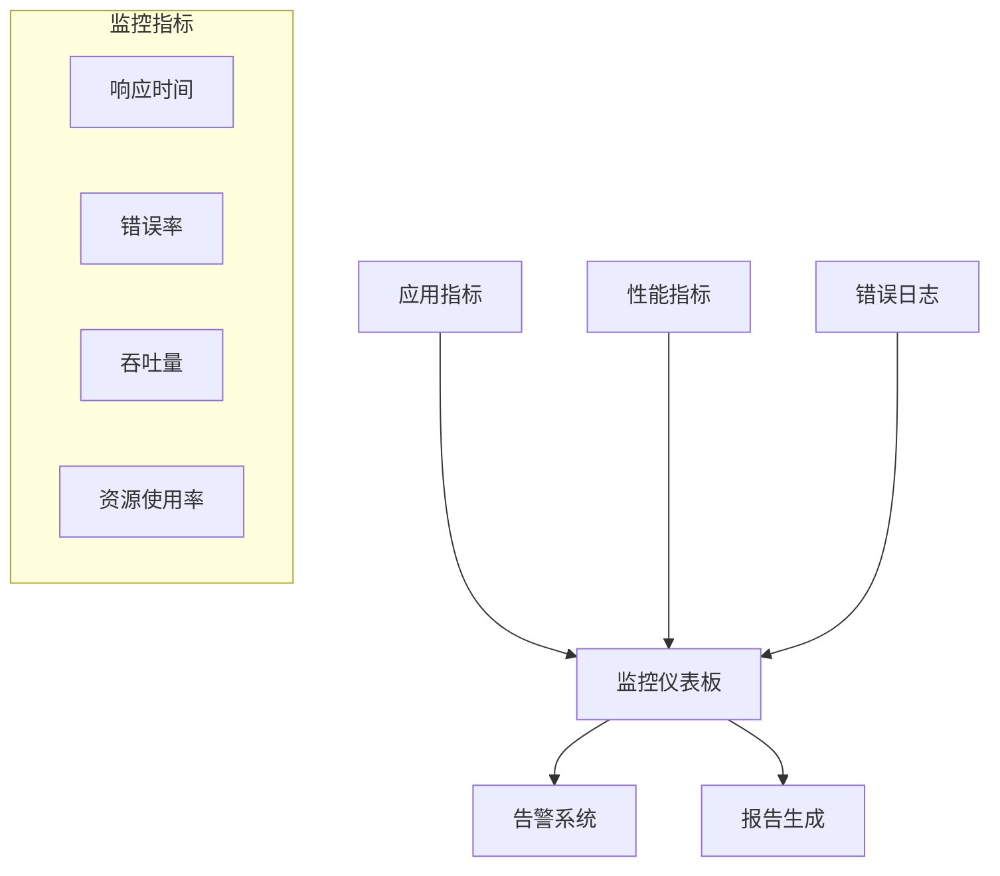
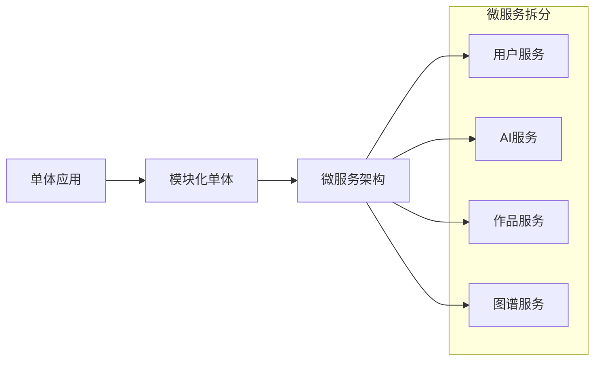

# 🏗️ Inspi.AI 系统架构文档

## 📋 架构概述

Inspi.AI 是一个基于 Next.js 的 AI 驱动教师智慧与IP孵化平台，集成了完整的项目管理规则增强系统。

## 🎯 系统架构图



## 🏛️ 技术栈

### 前端技术栈
- **框架**: Next.js 14 (App Router)
- **UI库**: React 18
- **样式**: Tailwind CSS
- **状态管理**: Zustand
- **类型检查**: TypeScript
- **PWA**: Service Worker + Manifest

### 后端技术栈
- **运行时**: Node.js
- **API框架**: Next.js API Routes
- **数据库**: MongoDB
- **缓存**: Redis
- **认证**: NextAuth.js
- **AI服务**: Google Gemini API

### 开发工具
- **测试**: Jest + Playwright
- **代码质量**: ESLint + Prettier
- **构建**: Next.js Build System
- **部署**: Vercel / Docker

### 项目管理系统
- **质量监控**: 自研质量检查系统
- **样式管理**: 自研样式恢复系统
- **状态管理**: 自研恢复点系统
- **监控仪表板**: 自研开发者仪表板

## 📦 模块架构

### 核心模块

#### 1. 用户认证模块
```typescript
// 认证流程
User Registration → Email Verification → JWT Token → Session Management
```

**组件**:
- `src/lib/auth/` - 认证逻辑
- `src/app/api/auth/` - 认证API
- `src/components/auth/` - 认证UI组件

#### 2. AI 服务模块
```typescript
// AI 服务流程
User Input → Prompt Template → Gemini API → Response Processing → UI Display
```

**组件**:
- `src/lib/ai/geminiService.ts` - AI服务封装
- `src/lib/ai/promptTemplates.ts` - 提示词模板
- `src/app/api/magic/` - AI API端点

#### 3. 作品管理模块
```typescript
// 作品管理流程
Create Work → Save to DB → Generate Preview → Share/Reuse → Analytics
```

**组件**:
- `src/lib/models/Work.ts` - 作品数据模型
- `src/app/api/works/` - 作品API
- `src/components/works/` - 作品UI组件

#### 4. 知识图谱模块
```typescript
// 知识图谱流程
Node Creation → Relationship Building → Graph Visualization → Collaborative Editing
```

**组件**:
- `src/lib/models/KnowledgeGraph.ts` - 图谱数据模型
- `src/components/graph/` - 图谱可视化组件
- `src/lib/graph/` - 图谱操作逻辑

### 项目管理模块

#### 1. 质量检查系统
```typescript
// 质量检查流程
Code Analysis → Test Execution → Quality Metrics → Report Generation
```

#### 2. 样式恢复系统
```typescript
// 样式管理流程
Style Snapshot → Visual Regression Detection → Rollback Management
```

#### 3. 恢复点系统
```typescript
// 恢复点流程
State Capture → Selective Recovery → Guided Restoration
```

## 🔄 数据流架构

### 请求处理流程


### 数据存储架构


## 🔐 安全架构

### 认证与授权


### 数据安全
- **传输加密**: HTTPS/TLS
- **数据加密**: 敏感数据加密存储
- **访问控制**: 基于角色的权限控制
- **审计日志**: 完整的操作日志记录

## ⚡ 性能架构

### 缓存策略


### 性能优化
- **代码分割**: 按路由和组件分割
- **懒加载**: 图片和组件懒加载
- **预加载**: 关键资源预加载
- **压缩**: Gzip/Brotli压缩
- **CDN**: 静态资源CDN分发

## 🔧 部署架构

### 生产环境架构


### 容器化部署
```dockerfile
# 多阶段构建
FROM node:18-alpine AS builder
WORKDIR /app
COPY package*.json ./
RUN npm ci --only=production

FROM node:18-alpine AS runner
WORKDIR /app
COPY --from=builder /app/node_modules ./node_modules
COPY . .
RUN npm run build
EXPOSE 3000
CMD ["npm", "start"]
```

## 📊 监控架构

### 系统监控


### 项目管理监控
- **质量指标**: 代码质量、测试覆盖率
- **性能指标**: 页面加载时间、API响应时间
- **稳定性指标**: 错误率、可用性
- **用户体验**: 用户行为分析、满意度

## 🔄 扩展架构

### 微服务演进路径


### 可扩展性设计
- **水平扩展**: 支持多实例部署
- **数据库分片**: 支持数据水平分割
- **缓存分层**: 多级缓存策略
- **异步处理**: 消息队列处理重任务

## 📚 架构决策记录

### ADR-001: 选择 Next.js 作为主框架
**决策**: 使用 Next.js 14 App Router  
**理由**: 
- 全栈开发能力
- 优秀的SEO支持
- 内置性能优化
- 丰富的生态系统

### ADR-002: 选择 MongoDB 作为主数据库
**决策**: 使用 MongoDB 作为主数据库  
**理由**:
- 灵活的文档模型
- 适合知识图谱存储
- 良好的扩展性
- 丰富的查询能力

### ADR-003: 自研项目管理系统
**决策**: 开发自研的项目管理规则增强系统  
**理由**:
- 深度集成项目需求
- 完全可控和定制
- 避免第三方依赖
- 提供独特价值

## 🎯 架构原则

### 设计原则
1. **单一职责**: 每个模块职责明确
2. **开放封闭**: 对扩展开放，对修改封闭
3. **依赖倒置**: 依赖抽象而非具体实现
4. **接口隔离**: 接口设计精简专一

### 质量属性
1. **可维护性**: 代码结构清晰，易于维护
2. **可扩展性**: 支持功能和性能扩展
3. **可靠性**: 系统稳定可靠运行
4. **安全性**: 数据和系统安全保护

---

**文档版本**: v1.0  
**最后更新**: 2025年9月5日  
**维护人**: 架构团队