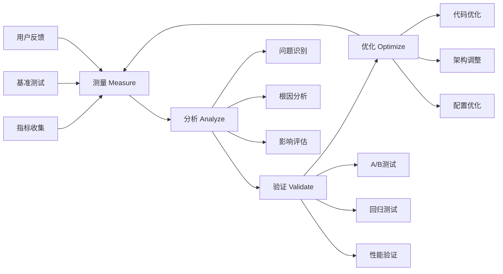
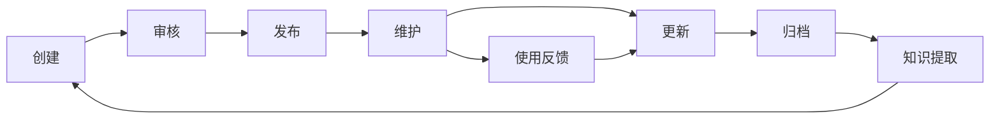

# 企业级开发框架指南

## 📋 概述

基于Task 16性能优化系统的成功实践，本文档总结了一套完整的企业级开发框架，适用于大型项目的系统性开发。

## 🏗️ 层次化开发方法论

### 1. 六层架构模型

```
Layer 5: 用户体验层 - 端到端测试、用户反馈、体验优化
Layer 4: 监控分析层 - 指标收集、性能分析、智能告警  
Layer 3: 应用优化层 - 代码优化、组件优化、交互优化
Layer 2: 资源分发层 - CDN、缓存、静态资源优化
Layer 1: 数据访问层 - 数据库、API、查询优化
Layer 0: 基础设施层 - 缓存、消息队列、存储
```

### 2. 开发顺序原则

**自下而上构建**：
1. 先建立稳固的基础设施（Layer 0-1）
2. 再优化资源分发和应用层（Layer 2-3）
3. 最后完善监控和用户体验（Layer 4-5）

**关键原则**：
- 每层都要有完整的测试覆盖
- 每层都要有监控和告警
- 每层都要有文档和最佳实践
- 层与层之间要有清晰的接口定义

## 🔄 MAVO开发闭环

### 核心流程：测量-分析-验证-优化



### 实施要点

#### 测量阶段
- **多维度指标**: 性能、质量、用户体验、业务指标
- **自动化收集**: 减少人工成本，提高数据准确性
- **实时监控**: 及时发现问题，快速响应

#### 分析阶段
- **数据驱动**: 基于真实数据而非主观判断
- **智能分析**: 使用算法自动识别问题和趋势
- **多角度分析**: 技术、业务、用户多个维度

#### 验证阶段
- **小范围试验**: 降低风险，验证效果
- **对照实验**: 确保改进的真实性
- **多环境测试**: 确保方案的普适性

#### 优化阶段
- **渐进式改进**: 避免大幅度变更带来的风险
- **自动化应用**: 减少人工错误，提高效率
- **效果跟踪**: 持续监控优化效果

## 🧪 测试驱动开发（TDD+）

### 扩展的TDD模型

```
传统TDD: 红 → 绿 → 重构
企业TDD+: 红 → 绿 → 重构 → 监控 → 优化 → 文档
```

### 测试金字塔升级版

```
                    E2E测试 (5%)
                 ↗              ↖
            集成测试 (15%)      用户测试 (5%)
         ↗                              ↖
    单元测试 (60%)                    性能测试 (15%)
```

### 测试类型和覆盖率要求

| 测试类型 | 覆盖率要求 | 自动化程度 | 执行频率 |
|----------|------------|------------|----------|
| 单元测试 | 90%+ | 100% | 每次提交 |
| 集成测试 | 80%+ | 100% | 每日构建 |
| 性能测试 | 核心场景100% | 90% | 每周执行 |
| E2E测试 | 关键路径100% | 80% | 发布前 |
| 用户测试 | 主要功能100% | 20% | 迭代结束 |

## 📊 智能化开发工具链

### 1. 自动化程度分级

| 级别 | 自动化程度 | 特征 | 适用场景 |
|------|------------|------|----------|
| L0 | 手工操作 | 完全人工 | 探索性开发 |
| L1 | 脚本辅助 | 简单脚本 | 重复性任务 |
| L2 | 工具集成 | 工具链整合 | 标准化流程 |
| L3 | 智能决策 | 基于规则 | 复杂场景 |
| L4 | 自主优化 | 机器学习 | 持续改进 |

### 2. 工具链成熟度模型

```
Level 1: 基础工具 - 代码编辑、版本控制、基础测试
Level 2: 集成工具 - CI/CD、自动化测试、代码质量检查
Level 3: 智能工具 - 性能分析、智能推荐、自动优化
Level 4: 自主工具 - 自动修复、智能决策、预测性维护
Level 5: 生态工具 - 跨项目学习、知识共享、最佳实践传播
```

### 3. 关键工具清单

#### 开发阶段
- **代码质量**: ESLint、Prettier、SonarQube
- **类型检查**: TypeScript、Flow
- **测试工具**: Jest、Playwright、Cypress
- **性能分析**: Lighthouse、WebPageTest、自定义监控

#### 构建阶段
- **构建工具**: Webpack、Vite、Next.js
- **代码分析**: Bundle Analyzer、Dependency Cruiser
- **安全扫描**: Snyk、OWASP ZAP
- **性能预算**: Size Limit、Performance Budget

#### 部署阶段
- **容器化**: Docker、Kubernetes
- **监控告警**: Prometheus、Grafana、AlertManager
- **日志分析**: ELK Stack、Fluentd
- **性能监控**: APM工具、自定义监控

## 📚 知识管理体系

### 1. 文档分层架构

```
Level 4: 战略文档 - 技术路线图、架构决策记录
Level 3: 战术文档 - 开发指南、最佳实践、设计模式
Level 2: 操作文档 - API文档、部署指南、故障排查
Level 1: 参考文档 - 代码注释、配置说明、变更日志
```

### 2. 文档生命周期管理



### 3. 知识传承机制

#### 显性知识传承
- **文档化**: 所有重要决策和实践都要文档化
- **标准化**: 建立统一的文档模板和规范
- **版本化**: 文档版本管理，追踪变更历史

#### 隐性知识传承
- **结对编程**: 经验丰富的开发者带新人
- **代码审查**: 通过审查过程传递最佳实践
- **技术分享**: 定期的技术分享和讨论

#### 知识沉淀机制
- **最佳实践库**: 收集和整理最佳实践
- **问题解决库**: 记录常见问题和解决方案
- **决策记录**: 记录重要的技术决策和原因

## 🎯 质量保证体系

### 1. 多维度质量模型

```
功能质量 (30%): 功能完整性、正确性、可用性
性能质量 (25%): 响应时间、吞吐量、资源使用
可靠性质量 (20%): 稳定性、容错性、恢复能力
安全质量 (15%): 数据安全、访问控制、漏洞防护
可维护性 (10%): 代码质量、文档完整性、可扩展性
```

### 2. 质量门禁机制

#### 代码提交门禁
- [ ] 单元测试通过率 ≥ 90%
- [ ] 代码覆盖率 ≥ 80%
- [ ] 代码质量评分 ≥ B级
- [ ] 安全扫描无高危漏洞
- [ ] 性能回归测试通过

#### 功能发布门禁
- [ ] 集成测试通过率 ≥ 95%
- [ ] 性能测试达标
- [ ] 安全测试通过
- [ ] 用户验收测试通过
- [ ] 文档更新完成

#### 生产发布门禁
- [ ] 所有测试通过
- [ ] 监控告警配置完成
- [ ] 回滚方案准备就绪
- [ ] 发布计划审核通过
- [ ] 应急响应团队就位

### 3. 持续改进机制

#### 质量度量
- **定量指标**: 缺陷率、测试覆盖率、性能指标
- **定性指标**: 代码可读性、架构合理性、用户满意度
- **趋势分析**: 质量指标的变化趋势和预测

#### 改进循环
```
问题识别 → 根因分析 → 改进方案 → 实施验证 → 效果评估 → 经验总结
```

## 🚀 创新实践指南

### 1. 技术创新框架

#### 创新分类
- **渐进式创新**: 在现有基础上的改进和优化
- **突破式创新**: 全新的技术方案和架构
- **颠覆式创新**: 改变游戏规则的技术变革

#### 创新评估维度
- **技术可行性**: 技术成熟度、实现难度、风险评估
- **业务价值**: 用户价值、商业价值、竞争优势
- **实施成本**: 开发成本、维护成本、机会成本

### 2. 实验驱动创新

#### 实验设计原则
- **假设驱动**: 明确的假设和预期结果
- **小步快跑**: 快速迭代，及时调整
- **数据验证**: 用数据说话，避免主观判断

#### 实验管理流程
```
假设提出 → 实验设计 → 快速实现 → 数据收集 → 结果分析 → 决策制定
```

### 3. 技术债务管理

#### 债务分类
- **代码债务**: 代码质量问题、技术选型问题
- **架构债务**: 架构设计问题、扩展性问题
- **测试债务**: 测试覆盖不足、测试质量问题
- **文档债务**: 文档缺失、文档过时问题

#### 债务管理策略
- **预防为主**: 在开发过程中避免产生技术债务
- **定期清理**: 定期评估和清理技术债务
- **优先级管理**: 根据影响程度确定清理优先级

## 📋 实施检查清单

### 项目启动阶段
- [ ] 确定技术架构和分层设计
- [ ] 建立开发工具链和自动化流程
- [ ] 制定质量标准和门禁机制
- [ ] 建立监控和告警体系
- [ ] 准备文档模板和知识库

### 开发过程中
- [ ] 遵循MAVO开发闭环
- [ ] 执行测试驱动开发
- [ ] 进行持续的代码审查
- [ ] 定期进行技术债务评估
- [ ] 及时更新文档和知识库

### 项目交付前
- [ ] 完成所有质量门禁检查
- [ ] 进行全面的性能测试
- [ ] 完善监控和告警配置
- [ ] 准备运维文档和应急预案
- [ ] 进行知识传承和培训

### 项目交付后
- [ ] 持续监控系统运行状态
- [ ] 定期进行性能优化
- [ ] 收集用户反馈和改进建议
- [ ] 总结经验和最佳实践
- [ ] 更新开发框架和指南

## 🎯 成功指标

### 开发效率指标
- **开发速度**: 功能点交付速度提升30%+
- **质量提升**: 缺陷率降低50%+
- **维护成本**: 维护成本降低40%+

### 系统质量指标
- **性能指标**: 响应时间、吞吐量、资源使用率
- **可靠性指标**: 可用性、故障恢复时间、错误率
- **安全指标**: 漏洞数量、安全事件、合规性

### 团队能力指标
- **技能提升**: 团队技术能力评估
- **知识共享**: 知识库使用率、分享频率
- **创新能力**: 技术创新项目数量、成功率

---

**版本**: v1.0  
**最后更新**: 2024-01-22  
**适用范围**: 企业级项目开发  
**维护者**: 技术架构团队