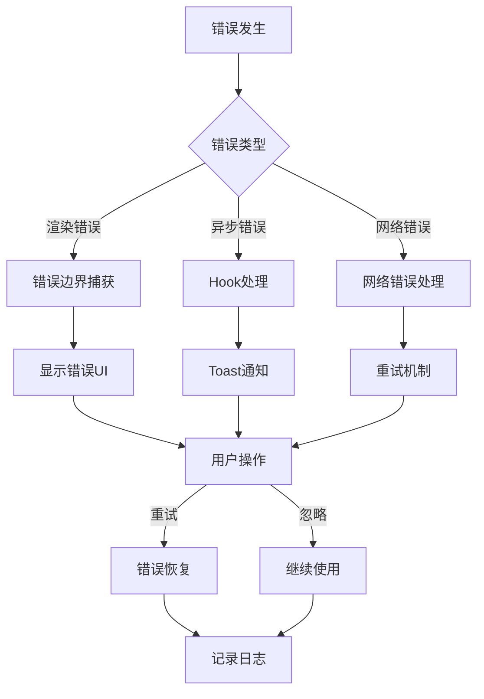

# 错误处理指南

## 📋 概述

本指南介绍了Inspi.AI平台的错误处理系统，包括前端错误边界、错误处理Hook、Toast通知系统等核心功能。

## 🏗️ 系统架构

### 错误处理层次结构

```
全局错误边界 (GlobalErrorBoundary)
├── 页面级错误边界 (Page Level)
├── 区域级错误边界 (Section Level)
└── 组件级错误边界 (Component Level)
```

### 错误处理流程



## 🔧 核心组件

### 1. 错误边界 (ErrorBoundary)

用于捕获React组件树中的JavaScript错误。

```tsx
import { ErrorBoundary } from '@/components/errors';

// 基础用法
<ErrorBoundary level="component">
  <YourComponent />
</ErrorBoundary>

// 高级用法
<ErrorBoundary
  level="page"
  resetKeys={[userId, dataVersion]}
  resetOnPropsChange
  onError={(error, errorInfo) => {
    console.log('错误处理:', error);
  }}
>
  <YourComponent />
</ErrorBoundary>
```

#### 错误级别

- **component**: 组件级错误，显示简单的错误提示
- **section**: 区域级错误，显示区域错误卡片
- **page**: 页面级错误，显示完整的错误页面

#### 重置机制

- `resetKeys`: 当指定的key发生变化时自动重置错误状态
- `resetOnPropsChange`: 启用props变化时的自动重置

### 2. 全局错误边界 (GlobalErrorBoundary)

应用级别的错误边界，捕获所有未处理的错误。

```tsx
import { ErrorBoundaryProvider } from '@/components/errors';

// 在根组件中使用
<ErrorBoundaryProvider>
  <App />
</ErrorBoundaryProvider>
```

### 3. 错误处理Hook (useErrorHandler)

用于处理异步错误和手动错误处理。

```tsx
import { useErrorHandler } from '@/hooks/useErrorHandler';

function MyComponent() {
  const { 
    error, 
    isError, 
    handleError, 
    clearError, 
    wrapAsync,
    retry 
  } = useErrorHandler({
    enableRetry: true,
    maxRetries: 3,
    onError: (error) => console.log('错误:', error)
  });

  const fetchData = wrapAsync(async () => {
    const response = await fetch('/api/data');
    if (!response.ok) {
      throw new Error('请求失败');
    }
    return response.json();
  });

  return (
    <div>
      {isError && (
        <div className="error">
          {error?.message}
          <button onClick={clearError}>清除</button>
          <button onClick={retry}>重试</button>
        </div>
      )}
      <button onClick={fetchData}>获取数据</button>
    </div>
  );
}
```

#### Hook配置选项

```tsx
interface UseErrorHandlerOptions {
  onError?: (error: Error) => void;        // 错误回调
  enableLogging?: boolean;                 // 启用日志记录
  enableRetry?: boolean;                   // 启用重试功能
  maxRetries?: number;                     // 最大重试次数
  retryDelay?: number;                     // 重试延迟
  enableToast?: boolean;                   // 启用Toast通知
  toastDuration?: number;                  // Toast显示时长
}
```

### 4. Toast通知系统

用于显示临时的错误和状态通知。

```tsx
import { useToast, useErrorToast } from '@/components/ui/ErrorToast';

function MyComponent() {
  const toast = useToast();
  const errorToast = useErrorToast();

  const handleSuccess = () => {
    toast.success('操作成功！');
  };

  const handleError = (error: Error) => {
    errorToast.showError(error, {
      title: '操作失败',
      action: {
        label: '重试',
        onClick: () => console.log('重试操作')
      }
    });
  };

  const handleNetworkError = () => {
    errorToast.showNetworkError(() => {
      // 重试网络请求
    });
  };

  return (
    <div>
      <button onClick={handleSuccess}>成功操作</button>
      <button onClick={() => handleError(new Error('测试错误'))}>
        错误操作
      </button>
      <button onClick={handleNetworkError}>网络错误</button>
    </div>
  );
}
```

#### Toast类型

- `success`: 成功提示（绿色）
- `error`: 错误提示（红色）
- `warning`: 警告提示（黄色）
- `info`: 信息提示（蓝色）

### 5. 重试按钮 (RetryButton)

提供智能重试功能的按钮组件。

```tsx
import { RetryButton, SmartRetryButton } from '@/components/errors';

// 基础重试按钮
<RetryButton
  onRetry={async () => {
    await fetchData();
  }}
  maxRetries={3}
  showCount={true}
/>

// 智能重试按钮（指数退避）
<SmartRetryButton
  onRetry={async () => {
    await fetchData();
  }}
  baseDelay={1000}
  maxDelay={30000}
  backoffFactor={2}
/>
```

### 6. 网络错误处理 (NetworkError)

专门处理网络相关错误的组件。

```tsx
import { NetworkError } from '@/components/errors';

<NetworkError
  onRetry={async () => {
    await retryNetworkRequest();
  }}
  retryInterval={5000}
  maxRetries={3}
  showOfflineStatus={true}
/>
```

## 🎯 使用场景

### 1. API请求错误处理

```tsx
import { useApiErrorHandler } from '@/hooks/useErrorHandler';

function DataComponent() {
  const { wrapAsync, error, isError } = useApiErrorHandler();

  const fetchUserData = wrapAsync(async (userId: string) => {
    const response = await fetch(`/api/users/${userId}`);
    if (!response.ok) {
      throw new Error(`HTTP ${response.status}: ${response.statusText}`);
    }
    return response.json();
  });

  return (
    <div>
      {isError && <div className="error">{error?.message}</div>}
      <button onClick={() => fetchUserData('123')}>
        获取用户数据
      </button>
    </div>
  );
}
```

### 2. 表单验证错误

```tsx
import { useErrorToast } from '@/components/ui/ErrorToast';

function LoginForm() {
  const errorToast = useErrorToast();

  const handleSubmit = async (formData: FormData) => {
    try {
      await submitLogin(formData);
    } catch (error) {
      if (error.message.includes('validation')) {
        errorToast.showValidationError('请检查输入信息');
      } else {
        errorToast.showError(error);
      }
    }
  };

  return (
    <form onSubmit={handleSubmit}>
      {/* 表单字段 */}
    </form>
  );
}
```

### 3. 组件级错误边界

```tsx
import { ErrorBoundary } from '@/components/errors';

function UserProfile({ userId }: { userId: string }) {
  return (
    <ErrorBoundary
      level="section"
      resetKeys={[userId]}
      resetOnPropsChange
    >
      <UserProfileContent userId={userId} />
    </ErrorBoundary>
  );
}
```

### 4. 全局错误处理

```tsx
import { useGlobalErrorHandler } from '@/hooks/useErrorHandler';

function App() {
  // 自动监听全局错误
  useGlobalErrorHandler();

  return (
    <div>
      {/* 应用内容 */}
    </div>
  );
}
```

## 🔍 错误分类

### 1. 客户端错误 (4xx)

- **400 Bad Request**: 请求参数错误
- **401 Unauthorized**: 未授权，需要登录
- **403 Forbidden**: 权限不足
- **404 Not Found**: 资源不存在

### 2. 服务器错误 (5xx)

- **500 Internal Server Error**: 服务器内部错误
- **502 Bad Gateway**: 网关错误
- **503 Service Unavailable**: 服务不可用
- **504 Gateway Timeout**: 网关超时

### 3. 网络错误

- **Network Error**: 网络连接失败
- **Timeout Error**: 请求超时
- **CORS Error**: 跨域请求错误

### 4. 应用错误

- **Validation Error**: 数据验证错误
- **Business Error**: 业务逻辑错误
- **Runtime Error**: 运行时错误

## 📊 错误监控

### 错误日志格式

```json
{
  "timestamp": "2024-01-15T10:30:00.000Z",
  "level": "error",
  "message": "Error handled by useErrorHandler",
  "error": {
    "name": "Error",
    "message": "网络请求失败",
    "stack": "Error: 网络请求失败\n    at fetch...",
    "code": "NETWORK_ERROR"
  },
  "metadata": {
    "errorId": "error-1642248600000-abc123",
    "userId": "user-123",
    "url": "https://app.inspi.ai/dashboard",
    "userAgent": "Mozilla/5.0...",
    "context": {
      "component": "DataFetcher",
      "action": "fetchUserData"
    }
  }
}
```

### 错误统计指标

- **错误率**: 错误请求数 / 总请求数
- **错误分布**: 按错误类型和HTTP状态码分组
- **恢复率**: 成功重试次数 / 总重试次数
- **用户影响**: 受错误影响的用户数量

## 🛠️ 最佳实践

### 1. 错误边界使用

```tsx
// ✅ 好的做法
<ErrorBoundary level="section" resetKeys={[dataId]}>
  <DataVisualization dataId={dataId} />
</ErrorBoundary>

// ❌ 避免的做法
<ErrorBoundary>
  <div>
    <Header />
    <MainContent />
    <Footer />
  </div>
</ErrorBoundary>
```

### 2. 错误消息设计

```tsx
// ✅ 用户友好的错误消息
const errorMessages = {
  NETWORK_ERROR: '网络连接失败，请检查网络后重试',
  VALIDATION_ERROR: '输入信息有误，请检查后重新提交',
  AUTH_ERROR: '登录已过期，请重新登录',
  SERVER_ERROR: '服务暂时不可用，请稍后重试'
};

// ❌ 技术性错误消息
const badErrorMessages = {
  NETWORK_ERROR: 'XMLHttpRequest failed with status 0',
  VALIDATION_ERROR: 'Schema validation failed at path /user/email',
  AUTH_ERROR: 'JWT token expired at 1642248600',
  SERVER_ERROR: 'Internal server error: NullPointerException'
};
```

### 3. 重试策略

```tsx
// ✅ 智能重试
const retryConfig = {
  maxRetries: 3,
  baseDelay: 1000,
  maxDelay: 10000,
  backoffFactor: 2,
  retryCondition: (error) => {
    // 只对网络错误和5xx错误重试
    return error.code === 'NETWORK_ERROR' || 
           (error.status >= 500 && error.status < 600);
  }
};

// ❌ 盲目重试
const badRetryConfig = {
  maxRetries: 10,
  delay: 100,
  retryAll: true // 对所有错误都重试
};
```

### 4. 错误恢复

```tsx
// ✅ 优雅降级
function UserProfile({ userId }) {
  const [userData, setUserData] = useState(null);
  const [error, setError] = useState(null);

  if (error) {
    return (
      <div className="user-profile-fallback">
        <div className="avatar-placeholder" />
        <div className="name-placeholder">用户信息加载失败</div>
        <button onClick={() => window.location.reload()}>
          刷新页面
        </button>
      </div>
    );
  }

  return <UserProfileContent data={userData} />;
}

// ❌ 硬性失败
function BadUserProfile({ userId }) {
  const userData = fetchUserData(userId); // 可能抛出错误
  return <UserProfileContent data={userData} />;
}
```

## 🧪 测试策略

### 1. 错误边界测试

```tsx
import { render, screen } from '@testing-library/react';
import { ErrorBoundary } from '@/components/errors';

test('应该捕获组件错误', () => {
  const ThrowError = () => {
    throw new Error('测试错误');
  };

  render(
    <ErrorBoundary>
      <ThrowError />
    </ErrorBoundary>
  );

  expect(screen.getByText('组件加载失败')).toBeInTheDocument();
});
```

### 2. Hook测试

```tsx
import { renderHook, act } from '@testing-library/react';
import { useErrorHandler } from '@/hooks/useErrorHandler';

test('应该处理异步错误', async () => {
  const { result } = renderHook(() => useErrorHandler());

  const asyncFn = result.current.wrapAsync(async () => {
    throw new Error('异步错误');
  });

  await act(async () => {
    await asyncFn();
  });

  expect(result.current.isError).toBe(true);
  expect(result.current.error?.message).toBe('异步错误');
});
```

### 3. 集成测试

```tsx
import { render, screen, fireEvent, waitFor } from '@testing-library/react';

test('错误恢复流程', async () => {
  let shouldFail = true;
  
  const TestComponent = () => {
    const { wrapAsync, error, clearError } = useErrorHandler();
    
    const operation = wrapAsync(async () => {
      if (shouldFail) throw new Error('操作失败');
      return '成功';
    });

    return (
      <div>
        {error && (
          <div>
            错误: {error.message}
            <button onClick={clearError}>清除</button>
          </div>
        )}
        <button onClick={operation}>执行操作</button>
      </div>
    );
  };

  render(<TestComponent />);

  // 触发错误
  fireEvent.click(screen.getByText('执行操作'));
  await waitFor(() => {
    expect(screen.getByText('错误: 操作失败')).toBeInTheDocument();
  });

  // 修复条件并清除错误
  shouldFail = false;
  fireEvent.click(screen.getByText('清除'));

  // 重新执行应该成功
  fireEvent.click(screen.getByText('执行操作'));
  await waitFor(() => {
    expect(screen.queryByText('错误:')).not.toBeInTheDocument();
  });
});
```

## 📈 性能考虑

### 1. 错误边界性能

- 错误边界不会影响正常渲染性能
- 错误发生时的重新渲染开销很小
- 避免在错误边界中进行复杂计算

### 2. 日志记录性能

- 使用异步日志写入
- 实施日志级别过滤
- 避免记录敏感信息

### 3. Toast通知性能

- 限制同时显示的Toast数量
- 使用虚拟化处理大量通知
- 及时清理过期的Toast

## 🔒 安全考虑

### 1. 错误信息安全

```tsx
// ✅ 安全的错误处理
const sanitizeError = (error: Error) => {
  if (process.env.NODE_ENV === 'production') {
    // 生产环境隐藏敏感信息
    return {
      message: '操作失败，请稍后重试',
      code: error.code || 'UNKNOWN_ERROR'
    };
  }
  return error;
};

// ❌ 不安全的错误处理
const unsafeError = (error: Error) => {
  // 直接暴露所有错误信息
  return error;
};
```

### 2. 日志安全

```tsx
// ✅ 安全的日志记录
const logError = (error: Error, context: any) => {
  const sanitizedContext = {
    ...context,
    // 移除敏感信息
    password: undefined,
    token: undefined,
    apiKey: undefined
  };
  
  logger.error('Error occurred', error, { metadata: sanitizedContext });
};
```

## 📚 相关资源

- [React错误边界文档](https://reactjs.org/docs/error-boundaries.html)
- [错误处理最佳实践](https://web.dev/error-handling/)
- [日志记录指南](./logging-best-practices.md)
- [测试策略文档](./testing-strategy.md)

---

**更新时间**: 2024-01-15  
**版本**: 1.0.0  
**维护者**: Inspi.AI开发团队