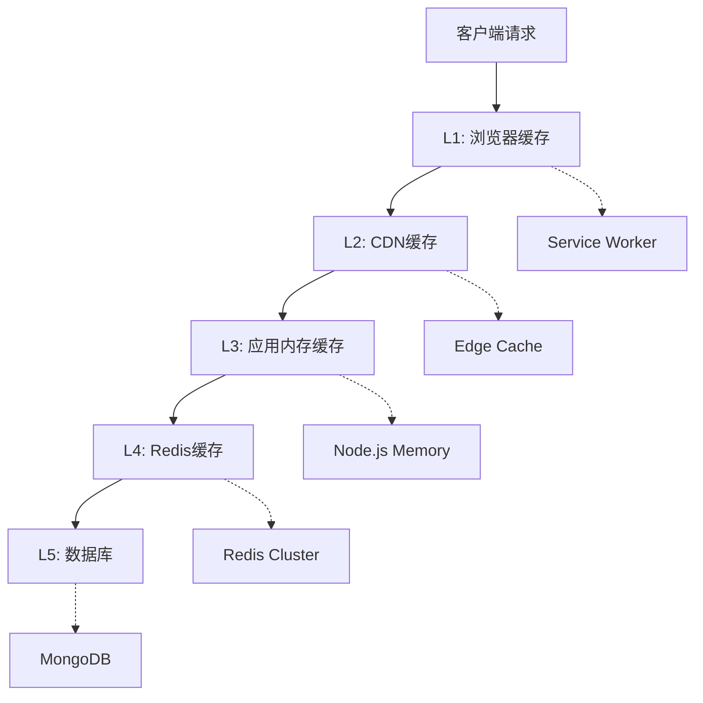

# 缓存策略指南

## 📋 概述

本指南详细介绍了Inspi AI平台的缓存架构、策略和最佳实践，帮助开发团队理解和优化缓存系统。

## 🏗️ 缓存架构

### 多层缓存架构



### 缓存层级说明

| 层级 | 类型 | 位置 | 容量 | 延迟 | TTL | 用途 |
|------|------|------|------|------|-----|------|
| L1 | 浏览器缓存 | 客户端 | ~100MB | 0ms | 1年 | 静态资源 |
| L2 | CDN缓存 | 边缘节点 | ~1GB | 10-50ms | 1天-1年 | 静态资源、API响应 |
| L3 | 内存缓存 | 应用服务器 | ~512MB | 1-5ms | 5分钟-1小时 | 热点数据 |
| L4 | Redis缓存 | 缓存服务器 | ~8GB | 1-10ms | 5分钟-24小时 | 会话、计算结果 |
| L5 | 数据库 | 数据库服务器 | ~100GB | 10-100ms | 永久 | 持久化数据 |

## 🎯 缓存策略

### 1. 缓存模式

#### Cache-Aside (旁路缓存)
```typescript
class CacheAsidePattern {
  async getData(key: string) {
    // 1. 先查缓存
    let data = await this.cache.get(key);
    
    if (data) {
      return data; // 缓存命中
    }
    
    // 2. 缓存未命中，查数据库
    data = await this.database.find(key);
    
    if (data) {
      // 3. 写入缓存
      await this.cache.set(key, data, 3600);
    }
    
    return data;
  }

  async updateData(key: string, data: any) {
    // 1. 更新数据库
    await this.database.update(key, data);
    
    // 2. 删除缓存（让下次读取时重新加载）
    await this.cache.delete(key);
  }
}
```

#### Write-Through (写穿透)
```typescript
class WriteThroughPattern {
  async setData(key: string, data: any) {
    // 1. 同时写入缓存和数据库
    await Promise.all([
      this.cache.set(key, data, 3600),
      this.database.save(key, data)
    ]);
  }
}
```

#### Write-Behind (写回)
```typescript
class WriteBehindPattern {
  private writeQueue = new Map();

  async setData(key: string, data: any) {
    // 1. 立即写入缓存
    await this.cache.set(key, data, 3600);
    
    // 2. 异步写入数据库
    this.writeQueue.set(key, data);
    this.scheduleWrite();
  }

  private async scheduleWrite() {
    // 批量写入数据库
    setTimeout(async () => {
      const batch = Array.from(this.writeQueue.entries());
      this.writeQueue.clear();
      
      await this.database.batchWrite(batch);
    }, 5000); // 5秒后批量写入
  }
}
```

### 2. 缓存策略配置

#### 基础配置
```typescript
export const CACHE_CONFIG = {
  // 用户相关数据
  USER: {
    ttl: 7200,        // 2小时
    maxSize: 2000,    // 最大条目数
    strategy: 'lru',  // LRU淘汰策略
    compress: true,   // 启用压缩
    serialize: true   // 序列化存储
  },
  
  // 作品数据
  WORK: {
    ttl: 3600,        // 1小时
    maxSize: 5000,
    strategy: 'lfu',  // LFU淘汰策略
    compress: true,
    serialize: true
  },
  
  // 排行榜数据
  RANKING: {
    ttl: 600,         // 10分钟
    maxSize: 100,
    strategy: 'ttl',  // TTL淘汰策略
    compress: false,
    serialize: true
  },
  
  // 知识图谱数据
  GRAPH: {
    ttl: 14400,       // 4小时
    maxSize: 500,
    strategy: 'lru',
    compress: true,
    serialize: true
  },
  
  // 静态资源
  STATIC: {
    ttl: 86400,       // 24小时
    maxSize: 10000,
    strategy: 'lru',
    compress: false,
    serialize: false
  }
} as const;
```

#### 动态TTL策略
```typescript
class DynamicTTLStrategy {
  calculateTTL(key: string, data: any, accessPattern: AccessPattern): number {
    const baseTTL = this.getBaseTTL(key);
    
    // 根据访问频率调整
    const frequencyMultiplier = Math.min(2, 1 + accessPattern.frequency / 10);
    
    // 根据数据大小调整
    const sizeMultiplier = data.size > 1024 ? 0.8 : 1.2;
    
    // 根据时间调整（夜间延长TTL）
    const timeMultiplier = this.isNightTime() ? 1.5 : 1;
    
    return baseTTL * frequencyMultiplier * sizeMultiplier * timeMultiplier;
  }

  private isNightTime(): boolean {
    const hour = new Date().getHours();
    return hour >= 22 || hour <= 6;
  }
}
```

### 3. 缓存键设计

#### 键命名规范
```typescript
class CacheKeyBuilder {
  // 用户缓存键
  static userKey(userId: string): string {
    return `user:${userId}`;
  }

  // 用户会话键
  static userSessionKey(userId: string): string {
    return `session:${userId}`;
  }

  // 作品缓存键
  static workKey(workId: string): string {
    return `work:${workId}`;
  }

  // 作品列表键
  static workListKey(type: string, page: number, filters?: any): string {
    const filterHash = filters ? this.hashObject(filters) : 'all';
    return `works:${type}:${page}:${filterHash}`;
  }

  // 排行榜键
  static rankingKey(type: string, period: string): string {
    return `ranking:${type}:${period}`;
  }

  // 知识图谱键
  static graphKey(userId: string, graphId?: string): string {
    return graphId ? `graph:${userId}:${graphId}` : `graph:${userId}`;
  }

  // API响应键
  static apiKey(endpoint: string, params?: any): string {
    const paramHash = params ? this.hashObject(params) : 'default';
    return `api:${endpoint}:${paramHash}`;
  }

  private static hashObject(obj: any): string {
    return require('crypto')
      .createHash('md5')
      .update(JSON.stringify(obj))
      .digest('hex')
      .substring(0, 8);
  }
}
```

#### 键空间管理
```typescript
class CacheNamespace {
  private static readonly NAMESPACES = {
    USER: 'u',
    WORK: 'w',
    RANKING: 'r',
    GRAPH: 'g',
    API: 'a',
    TEMP: 't'
  } as const;

  static getNamespacedKey(namespace: keyof typeof CacheNamespace.NAMESPACES, key: string): string {
    return `${CacheNamespace.NAMESPACES[namespace]}:${key}`;
  }

  static parseKey(namespacedKey: string): { namespace: string; key: string } {
    const [namespace, ...keyParts] = namespacedKey.split(':');
    return {
      namespace,
      key: keyParts.join(':')
    };
  }
}
```

## 🔄 缓存更新策略

### 1. 缓存失效策略

#### 基于时间的失效
```typescript
class TimeBasedInvalidation {
  private timers = new Map<string, NodeJS.Timeout>();

  setWithTTL(key: string, value: any, ttl: number): void {
    // 设置缓存值
    this.cache.set(key, value);
    
    // 清除旧的定时器
    const oldTimer = this.timers.get(key);
    if (oldTimer) {
      clearTimeout(oldTimer);
    }
    
    // 设置新的定时器
    const timer = setTimeout(() => {
      this.cache.delete(key);
      this.timers.delete(key);
    }, ttl * 1000);
    
    this.timers.set(key, timer);
  }
}
```

#### 基于事件的失效
```typescript
class EventBasedInvalidation {
  private eventEmitter = new EventEmitter();

  constructor() {
    // 监听数据更新事件
    this.eventEmitter.on('user:updated', (userId) => {
      this.invalidateUserCache(userId);
    });

    this.eventEmitter.on('work:published', (workId) => {
      this.invalidateWorkCache(workId);
      this.invalidateWorkListCache();
    });

    this.eventEmitter.on('ranking:changed', () => {
      this.invalidateRankingCache();
    });
  }

  private async invalidateUserCache(userId: string): Promise<void> {
    const keys = [
      CacheKeyBuilder.userKey(userId),
      CacheKeyBuilder.userSessionKey(userId)
    ];
    
    await Promise.all(keys.map(key => this.cache.delete(key)));
  }

  private async invalidateWorkListCache(): Promise<void> {
    // 删除所有作品列表缓存
    const pattern = 'works:*';
    const keys = await this.cache.keys(pattern);
    await Promise.all(keys.map(key => this.cache.delete(key)));
  }
}
```

#### 基于依赖的失效
```typescript
class DependencyBasedInvalidation {
  private dependencies = new Map<string, Set<string>>();

  addDependency(key: string, dependsOn: string): void {
    if (!this.dependencies.has(dependsOn)) {
      this.dependencies.set(dependsOn, new Set());
    }
    this.dependencies.get(dependsOn)!.add(key);
  }

  async invalidate(key: string): Promise<void> {
    // 删除主键
    await this.cache.delete(key);
    
    // 删除依赖的键
    const dependentKeys = this.dependencies.get(key);
    if (dependentKeys) {
      await Promise.all(
        Array.from(dependentKeys).map(depKey => this.invalidate(depKey))
      );
      this.dependencies.delete(key);
    }
  }
}
```

### 2. 缓存预热策略

#### 应用启动预热
```typescript
class CacheWarmup {
  async warmupOnStartup(): Promise<void> {
    console.log('Starting cache warmup...');
    
    await Promise.all([
      this.warmupPopularWorks(),
      this.warmupLeaderboard(),
      this.warmupTrendingTags(),
      this.warmupSystemConfig()
    ]);
    
    console.log('Cache warmup completed');
  }

  private async warmupPopularWorks(): Promise<void> {
    const popularWorks = await this.database.getPopularWorks(50);
    
    for (const work of popularWorks) {
      const key = CacheKeyBuilder.workKey(work.id);
      await this.cache.set(key, work, CACHE_CONFIG.WORK.ttl);
    }
  }

  private async warmupLeaderboard(): Promise<void> {
    const rankings = ['contribution', 'popular', 'recent'];
    const periods = ['daily', 'weekly', 'monthly'];
    
    for (const ranking of rankings) {
      for (const period of periods) {
        const data = await this.database.getRanking(ranking, period);
        const key = CacheKeyBuilder.rankingKey(ranking, period);
        await this.cache.set(key, data, CACHE_CONFIG.RANKING.ttl);
      }
    }
  }
}
```

#### 智能预热
```typescript
class SmartWarmup {
  async predictiveWarmup(): Promise<void> {
    // 基于历史访问模式预测热点数据
    const predictions = await this.analyzeAccessPatterns();
    
    for (const prediction of predictions) {
      if (prediction.confidence > 0.7) {
        await this.preloadData(prediction.key, prediction.type);
      }
    }
  }

  private async analyzeAccessPatterns(): Promise<Prediction[]> {
    // 分析访问日志，预测可能被访问的数据
    const accessLogs = await this.getRecentAccessLogs();
    
    return this.machineLearningPredictor.predict(accessLogs);
  }
}
```

## 📊 缓存监控

### 1. 性能指标

#### 关键指标定义
```typescript
interface CacheMetrics {
  // 命中率指标
  hitRate: number;          // 缓存命中率
  missRate: number;         // 缓存未命中率
  
  // 性能指标
  avgResponseTime: number;  // 平均响应时间
  p95ResponseTime: number;  // 95分位响应时间
  p99ResponseTime: number;  // 99分位响应时间
  
  // 容量指标
  memoryUsage: number;      // 内存使用量
  keyCount: number;         // 键数量
  evictionCount: number;    // 淘汰次数
  
  // 操作指标
  getOperations: number;    // 读操作次数
  setOperations: number;    // 写操作次数
  deleteOperations: number; // 删除操作次数
}
```

#### 指标收集器
```typescript
class CacheMetricsCollector {
  private metrics: CacheMetrics = {
    hitRate: 0,
    missRate: 0,
    avgResponseTime: 0,
    p95ResponseTime: 0,
    p99ResponseTime: 0,
    memoryUsage: 0,
    keyCount: 0,
    evictionCount: 0,
    getOperations: 0,
    setOperations: 0,
    deleteOperations: 0
  };

  private responseTimes: number[] = [];

  recordHit(): void {
    this.metrics.getOperations++;
    // 命中率计算在定期更新中进行
  }

  recordMiss(): void {
    this.metrics.getOperations++;
    // 未命中率计算在定期更新中进行
  }

  recordResponseTime(time: number): void {
    this.responseTimes.push(time);
    
    // 保持最近1000次记录
    if (this.responseTimes.length > 1000) {
      this.responseTimes.shift();
    }
  }

  calculateMetrics(): CacheMetrics {
    // 计算命中率
    const totalHits = this.getTotalHits();
    const totalRequests = this.metrics.getOperations;
    this.metrics.hitRate = totalRequests > 0 ? totalHits / totalRequests : 0;
    this.metrics.missRate = 1 - this.metrics.hitRate;

    // 计算响应时间指标
    if (this.responseTimes.length > 0) {
      const sorted = this.responseTimes.sort((a, b) => a - b);
      this.metrics.avgResponseTime = sorted.reduce((a, b) => a + b, 0) / sorted.length;
      this.metrics.p95ResponseTime = sorted[Math.floor(sorted.length * 0.95)];
      this.metrics.p99ResponseTime = sorted[Math.floor(sorted.length * 0.99)];
    }

    return { ...this.metrics };
  }
}
```

### 2. 监控告警

#### 告警规则
```typescript
const CACHE_ALERT_RULES = [
  {
    name: '缓存命中率过低',
    condition: 'hitRate < 0.8',
    severity: 'warning',
    description: '缓存命中率低于80%，可能影响性能'
  },
  {
    name: '缓存响应时间过高',
    condition: 'p95ResponseTime > 100',
    severity: 'critical',
    description: '95%的缓存请求响应时间超过100ms'
  },
  {
    name: '缓存内存使用过高',
    condition: 'memoryUsage > 0.9 * maxMemory',
    severity: 'warning',
    description: '缓存内存使用超过90%'
  },
  {
    name: '缓存淘汰频率过高',
    condition: 'evictionRate > 100/minute',
    severity: 'warning',
    description: '缓存淘汰频率过高，可能需要增加容量'
  }
];
```

#### 监控仪表板
```typescript
class CacheDashboard {
  async generateReport(): Promise<CacheReport> {
    const metrics = await this.metricsCollector.calculateMetrics();
    
    return {
      timestamp: new Date(),
      metrics,
      health: this.assessHealth(metrics),
      recommendations: this.generateRecommendations(metrics),
      trends: await this.getTrends()
    };
  }

  private assessHealth(metrics: CacheMetrics): 'healthy' | 'warning' | 'critical' {
    if (metrics.hitRate < 0.7 || metrics.p95ResponseTime > 200) {
      return 'critical';
    }
    if (metrics.hitRate < 0.85 || metrics.p95ResponseTime > 100) {
      return 'warning';
    }
    return 'healthy';
  }

  private generateRecommendations(metrics: CacheMetrics): string[] {
    const recommendations: string[] = [];

    if (metrics.hitRate < 0.8) {
      recommendations.push('考虑增加缓存TTL或优化缓存键设计');
    }
    
    if (metrics.evictionCount > 1000) {
      recommendations.push('考虑增加缓存容量或优化淘汰策略');
    }
    
    if (metrics.p95ResponseTime > 50) {
      recommendations.push('考虑优化缓存存储或网络配置');
    }

    return recommendations;
  }
}
```

## 🛠️ 缓存工具

### 1. 缓存管理工具

#### 缓存清理工具
```bash
#!/bin/bash
# cache-cleanup.sh

echo "🧹 Starting cache cleanup..."

# 清理过期键
redis-cli --scan --pattern "*" | xargs -I {} redis-cli TTL {} | grep -E "^-1$" | wc -l
echo "Found expired keys, cleaning up..."

# 清理特定模式的键
redis-cli --scan --pattern "temp:*" | xargs redis-cli DEL
echo "Cleaned temporary cache entries"

# 清理大对象
redis-cli --bigkeys
echo "Identified large cache objects"

echo "✅ Cache cleanup completed"
```

#### 缓存分析工具
```typescript
class CacheAnalyzer {
  async analyzeKeyDistribution(): Promise<KeyDistribution> {
    const keys = await this.cache.keys('*');
    const distribution: { [namespace: string]: number } = {};

    for (const key of keys) {
      const namespace = key.split(':')[0];
      distribution[namespace] = (distribution[namespace] || 0) + 1;
    }

    return {
      total: keys.length,
      distribution,
      topNamespaces: Object.entries(distribution)
        .sort(([,a], [,b]) => b - a)
        .slice(0, 10)
    };
  }

  async analyzeTTLDistribution(): Promise<TTLDistribution> {
    const keys = await this.cache.keys('*');
    const ttlRanges = {
      'expired': 0,
      '0-1h': 0,
      '1h-1d': 0,
      '1d-1w': 0,
      '1w+': 0,
      'no-expire': 0
    };

    for (const key of keys) {
      const ttl = await this.cache.ttl(key);
      
      if (ttl === -2) ttlRanges.expired++;
      else if (ttl === -1) ttlRanges['no-expire']++;
      else if (ttl <= 3600) ttlRanges['0-1h']++;
      else if (ttl <= 86400) ttlRanges['1h-1d']++;
      else if (ttl <= 604800) ttlRanges['1d-1w']++;
      else ttlRanges['1w+']++;
    }

    return ttlRanges;
  }
}
```

### 2. 开发工具

#### 缓存调试器
```typescript
class CacheDebugger {
  private debugMode = process.env.NODE_ENV === 'development';

  async get(key: string): Promise<any> {
    const startTime = Date.now();
    const value = await this.cache.get(key);
    const endTime = Date.now();

    if (this.debugMode) {
      console.log(`🔍 Cache GET: ${key}`);
      console.log(`   Result: ${value ? 'HIT' : 'MISS'}`);
      console.log(`   Time: ${endTime - startTime}ms`);
      if (value) {
        console.log(`   Size: ${JSON.stringify(value).length} bytes`);
      }
    }

    return value;
  }

  async set(key: string, value: any, ttl?: number): Promise<void> {
    const startTime = Date.now();
    await this.cache.set(key, value, ttl);
    const endTime = Date.now();

    if (this.debugMode) {
      console.log(`💾 Cache SET: ${key}`);
      console.log(`   TTL: ${ttl || 'default'}`);
      console.log(`   Size: ${JSON.stringify(value).length} bytes`);
      console.log(`   Time: ${endTime - startTime}ms`);
    }
  }
}
```

## 📋 最佳实践

### 1. 缓存设计原则

#### DO's (推荐做法)
- ✅ 使用有意义的缓存键命名
- ✅ 设置合适的TTL避免数据过期
- ✅ 实现缓存预热机制
- ✅ 监控缓存性能指标
- ✅ 使用压缩减少内存使用
- ✅ 实现缓存降级策略
- ✅ 定期清理无用缓存

#### DON'Ts (避免做法)
- ❌ 缓存大对象而不压缩
- ❌ 使用过长或过短的TTL
- ❌ 忽略缓存一致性问题
- ❌ 缓存敏感信息
- ❌ 过度依赖缓存
- ❌ 忽略缓存穿透问题
- ❌ 不监控缓存性能

### 2. 性能优化建议

#### 缓存键优化
```typescript
// ❌ 不好的键设计
const badKey = `user_${userId}_profile_${new Date().getTime()}`;

// ✅ 好的键设计
const goodKey = CacheKeyBuilder.userKey(userId);
```

#### 批量操作优化
```typescript
// ❌ 逐个操作
for (const key of keys) {
  await cache.get(key);
}

// ✅ 批量操作
const values = await cache.mget(keys);
```

#### 内存使用优化
```typescript
// ✅ 使用压缩
const compressedValue = await compress(JSON.stringify(largeObject));
await cache.set(key, compressedValue, ttl);

// ✅ 分页缓存大列表
const pageSize = 20;
const totalPages = Math.ceil(totalItems / pageSize);
for (let page = 0; page < totalPages; page++) {
  const pageKey = `${listKey}:page:${page}`;
  const pageData = items.slice(page * pageSize, (page + 1) * pageSize);
  await cache.set(pageKey, pageData, ttl);
}
```

### 3. 故障处理

#### 缓存降级
```typescript
class CacheWithFallback {
  async get(key: string): Promise<any> {
    try {
      return await this.cache.get(key);
    } catch (error) {
      console.warn('Cache error, falling back to database:', error);
      return await this.database.get(key);
    }
  }

  async set(key: string, value: any, ttl?: number): Promise<void> {
    try {
      await this.cache.set(key, value, ttl);
    } catch (error) {
      console.warn('Cache write failed:', error);
      // 继续执行，不影响主流程
    }
  }
}
```

#### 缓存雪崩防护
```typescript
class CacheAvalancheProtection {
  private readonly jitterRange = 0.1; // 10%的随机抖动

  calculateTTL(baseTTL: number): number {
    const jitter = (Math.random() - 0.5) * 2 * this.jitterRange;
    return Math.floor(baseTTL * (1 + jitter));
  }

  async setWithJitter(key: string, value: any, baseTTL: number): Promise<void> {
    const ttl = this.calculateTTL(baseTTL);
    await this.cache.set(key, value, ttl);
  }
}
```

## 📚 参考资源

### 技术文档
- [Redis官方文档](https://redis.io/documentation)
- [缓存模式详解](https://docs.microsoft.com/en-us/azure/architecture/patterns/cache-aside)
- [Web缓存最佳实践](https://developers.google.com/web/fundamentals/performance/optimizing-content-efficiency/http-caching)

### 监控工具
- [Redis监控](https://redis.io/topics/admin)
- [缓存性能分析](https://github.com/redis/redis-doc/blob/master/topics/latency-monitor.md)

---

**文档版本**: v1.0  
**最后更新**: 2024-01-22  
**维护者**: 缓存架构团队