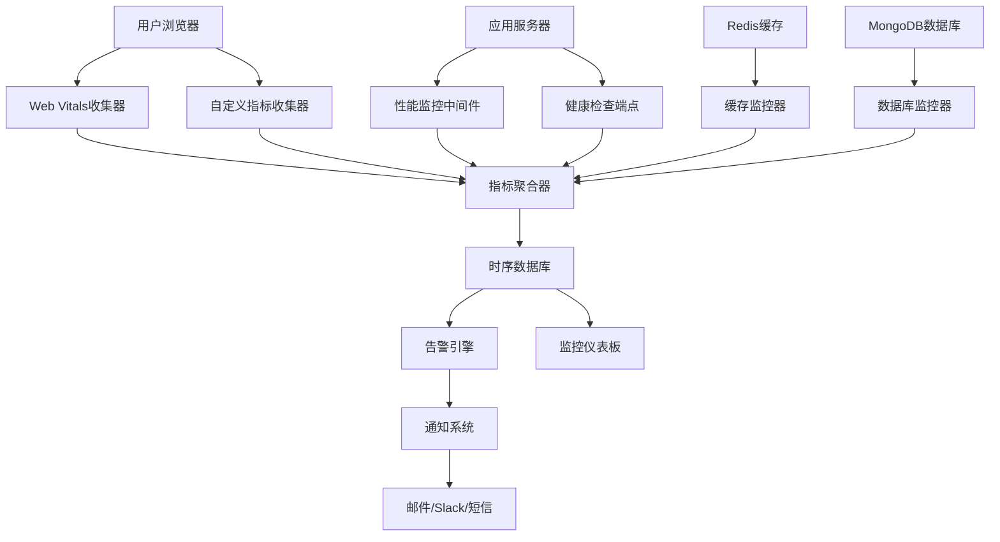
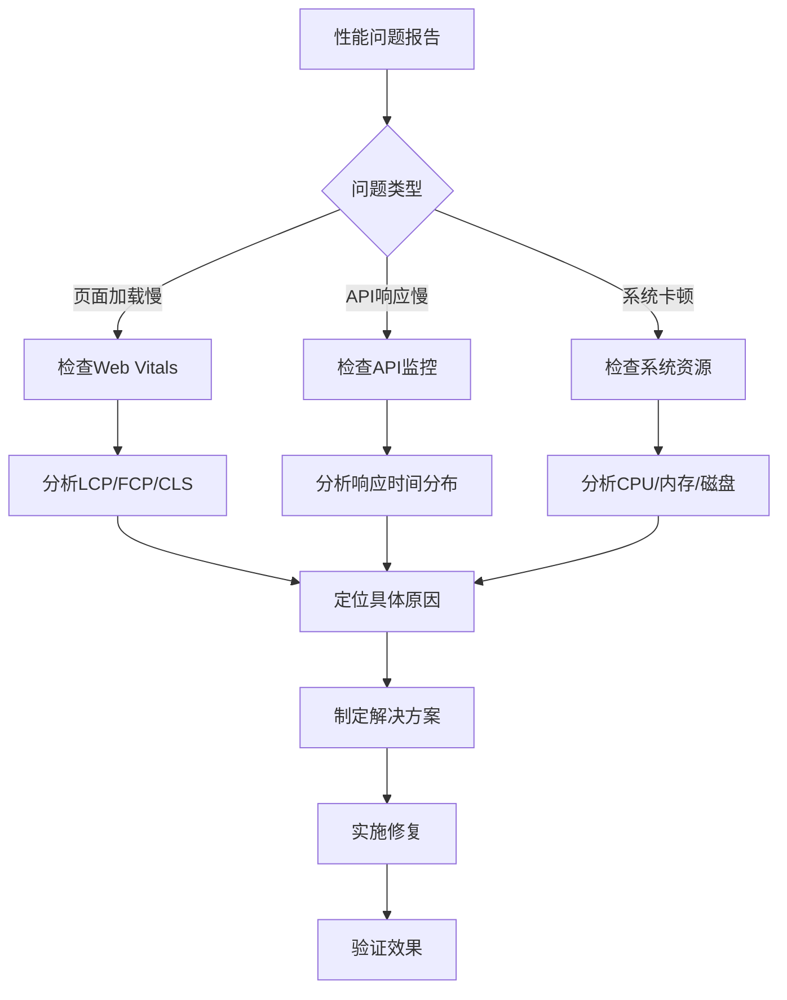

# 性能监控运维指南

## 📋 概述

本指南为Inspi AI平台的性能监控和运维提供完整的操作手册，包括监控系统配置、告警设置、故障排查和日常维护。

## 🎯 监控目标

### 核心性能指标

| 指标类别 | 指标名称 | 目标值 | 告警阈值 | 严重阈值 |
|----------|----------|--------|----------|----------|
| **Web Vitals** | LCP | < 2.5s | > 4.0s | > 6.0s |
| | FID | < 100ms | > 300ms | > 500ms |
| | CLS | < 0.1 | > 0.25 | > 0.4 |
| **响应时间** | TTFB | < 800ms | > 1.5s | > 3.0s |
| | API响应 | < 500ms | > 1.0s | > 2.0s |
| **缓存性能** | 命中率 | > 90% | < 80% | < 70% |
| | 响应时间 | < 50ms | > 100ms | > 200ms |
| **系统资源** | CPU使用率 | < 70% | > 85% | > 95% |
| | 内存使用率 | < 80% | > 90% | > 95% |
| | 磁盘使用率 | < 80% | > 90% | > 95% |

## 🔧 监控系统架构

### 监控组件图



### 监控数据流

1. **数据收集**: 从各个组件收集性能指标
2. **数据聚合**: 将指标数据聚合和预处理
3. **数据存储**: 存储到时序数据库
4. **告警检测**: 实时检测异常和阈值违规
5. **通知发送**: 发送告警通知给相关人员
6. **可视化展示**: 在仪表板中展示监控数据

## 📊 监控指标详解

### 1. Web Vitals 监控

#### 指标收集
```typescript
// Web Vitals 自动收集
import { globalWebVitalsMonitor } from '@/lib/performance/web-vitals';

// 启动监控
globalWebVitalsMonitor.start({
  reportingInterval: 30000, // 30秒上报一次
  sampleRate: 1.0,          // 100%采样率
  endpoint: '/api/metrics/web-vitals'
});

// 自定义事件监听
globalWebVitalsMonitor.onMetric((metric) => {
  // 实时处理指标数据
  if (metric.rating === 'poor') {
    console.warn(`Poor ${metric.name}: ${metric.value}${metric.unit}`);
  }
});
```

#### 指标分析
```typescript
class WebVitalsAnalyzer {
  analyzeMetrics(metrics: WebVitalsMetric[]): AnalysisResult {
    const analysis = {
      lcp: this.analyzeLCP(metrics.filter(m => m.name === 'LCP')),
      fid: this.analyzeFID(metrics.filter(m => m.name === 'FID')),
      cls: this.analyzeCLS(metrics.filter(m => m.name === 'CLS')),
      trends: this.analyzeTrends(metrics)
    };

    return {
      ...analysis,
      overallScore: this.calculateOverallScore(analysis),
      recommendations: this.generateRecommendations(analysis)
    };
  }

  private analyzeLCP(lcpMetrics: WebVitalsMetric[]): LCPAnalysis {
    const values = lcpMetrics.map(m => m.value);
    return {
      p50: this.percentile(values, 0.5),
      p75: this.percentile(values, 0.75),
      p95: this.percentile(values, 0.95),
      trend: this.calculateTrend(values),
      issues: this.identifyLCPIssues(values)
    };
  }
}
```

### 2. 应用性能监控

#### 中间件监控
```typescript
// 性能监控中间件
export function performanceMiddleware(req: Request, res: Response, next: NextFunction) {
  const startTime = Date.now();
  const startMemory = process.memoryUsage();

  // 监控请求
  res.on('finish', () => {
    const endTime = Date.now();
    const endMemory = process.memoryUsage();
    
    const metrics = {
      method: req.method,
      url: req.url,
      statusCode: res.statusCode,
      responseTime: endTime - startTime,
      memoryDelta: endMemory.heapUsed - startMemory.heapUsed,
      timestamp: new Date()
    };

    // 发送指标到监控系统
    metricsCollector.record('http_request', metrics);

    // 检查异常情况
    if (metrics.responseTime > 5000) {
      logger.warn('Slow request detected', metrics);
    }
  });

  next();
}
```

#### API性能监控
```typescript
class APIPerformanceMonitor {
  private metrics = new Map<string, APIMetrics>();

  trackRequest(endpoint: string, method: string, responseTime: number, statusCode: number) {
    const key = `${method}:${endpoint}`;
    const current = this.metrics.get(key) || {
      totalRequests: 0,
      totalTime: 0,
      errorCount: 0,
      responseTimes: []
    };

    current.totalRequests++;
    current.totalTime += responseTime;
    current.responseTimes.push(responseTime);
    
    if (statusCode >= 400) {
      current.errorCount++;
    }

    // 保持最近1000次请求的记录
    if (current.responseTimes.length > 1000) {
      current.responseTimes.shift();
    }

    this.metrics.set(key, current);
  }

  getMetrics(endpoint: string, method: string): APIMetrics {
    const key = `${method}:${endpoint}`;
    const metrics = this.metrics.get(key);
    
    if (!metrics) return null;

    const sortedTimes = metrics.responseTimes.sort((a, b) => a - b);
    
    return {
      ...metrics,
      avgResponseTime: metrics.totalTime / metrics.totalRequests,
      p50: sortedTimes[Math.floor(sortedTimes.length * 0.5)],
      p95: sortedTimes[Math.floor(sortedTimes.length * 0.95)],
      p99: sortedTimes[Math.floor(sortedTimes.length * 0.99)],
      errorRate: metrics.errorCount / metrics.totalRequests
    };
  }
}
```

### 3. 系统资源监控

#### 系统指标收集
```typescript
class SystemMonitor {
  private collectInterval: NodeJS.Timeout;

  start() {
    this.collectInterval = setInterval(() => {
      this.collectMetrics();
    }, 30000); // 每30秒收集一次
  }

  private async collectMetrics() {
    const metrics = {
      // CPU指标
      cpu: {
        usage: await this.getCPUUsage(),
        loadAverage: os.loadavg()
      },
      
      // 内存指标
      memory: {
        total: os.totalmem(),
        free: os.freemem(),
        used: os.totalmem() - os.freemem(),
        usage: (os.totalmem() - os.freemem()) / os.totalmem(),
        heap: process.memoryUsage()
      },
      
      // 磁盘指标
      disk: await this.getDiskUsage(),
      
      // 网络指标
      network: await this.getNetworkStats(),
      
      // 进程指标
      process: {
        uptime: process.uptime(),
        pid: process.pid,
        version: process.version
      },
      
      timestamp: new Date()
    };

    // 发送到监控系统
    await this.sendMetrics(metrics);
    
    // 检查告警条件
    this.checkAlerts(metrics);
  }

  private async getCPUUsage(): Promise<number> {
    return new Promise((resolve) => {
      const startUsage = process.cpuUsage();
      const startTime = Date.now();
      
      setTimeout(() => {
        const endUsage = process.cpuUsage(startUsage);
        const endTime = Date.now();
        
        const totalTime = (endTime - startTime) * 1000; // 转换为微秒
        const cpuTime = endUsage.user + endUsage.system;
        const usage = (cpuTime / totalTime) * 100;
        
        resolve(Math.min(100, Math.max(0, usage)));
      }, 1000);
    });
  }
}
```

### 4. 数据库监控

#### MongoDB监控
```typescript
class DatabaseMonitor {
  private db: Db;

  async collectMetrics(): Promise<DatabaseMetrics> {
    const serverStatus = await this.db.admin().serverStatus();
    const dbStats = await this.db.stats();
    
    return {
      // 连接指标
      connections: {
        current: serverStatus.connections.current,
        available: serverStatus.connections.available,
        totalCreated: serverStatus.connections.totalCreated
      },
      
      // 操作指标
      operations: {
        insert: serverStatus.opcounters.insert,
        query: serverStatus.opcounters.query,
        update: serverStatus.opcounters.update,
        delete: serverStatus.opcounters.delete,
        command: serverStatus.opcounters.command
      },
      
      // 内存指标
      memory: {
        resident: serverStatus.mem.resident,
        virtual: serverStatus.mem.virtual,
        mapped: serverStatus.mem.mapped
      },
      
      // 存储指标
      storage: {
        dataSize: dbStats.dataSize,
        storageSize: dbStats.storageSize,
        indexSize: dbStats.indexSize,
        collections: dbStats.collections,
        indexes: dbStats.indexes
      },
      
      // 性能指标
      performance: {
        avgObjSize: dbStats.avgObjSize,
        numExtents: dbStats.numExtents,
        fileSize: dbStats.fileSize
      }
    };
  }

  async getSlowQueries(threshold: number = 100): Promise<SlowQuery[]> {
    // 获取慢查询日志
    const slowQueries = await this.db.admin().command({
      getLog: 'global'
    });

    return slowQueries.log
      .filter((log: string) => log.includes('slow operation'))
      .map((log: string) => this.parseSlowQuery(log))
      .filter((query: SlowQuery) => query.duration > threshold);
  }
}
```

## 🚨 告警系统

### 1. 告警规则配置

#### 告警规则定义
```typescript
interface AlertRule {
  id: string;
  name: string;
  description: string;
  metric: string;
  condition: 'gt' | 'lt' | 'eq' | 'ne';
  threshold: number;
  duration: number;        // 持续时间（秒）
  severity: 'low' | 'medium' | 'high' | 'critical';
  enabled: boolean;
  actions: AlertAction[];
}

const ALERT_RULES: AlertRule[] = [
  {
    id: 'lcp-high',
    name: 'LCP过高告警',
    description: 'LCP超过4秒持续5分钟',
    metric: 'web_vitals.lcp.p95',
    condition: 'gt',
    threshold: 4000,
    duration: 300,
    severity: 'high',
    enabled: true,
    actions: [
      { type: 'email', recipients: ['dev-team@company.com'] },
      { type: 'slack', channel: '#alerts' }
    ]
  },
  {
    id: 'cache-hit-rate-low',
    name: '缓存命中率过低',
    description: '缓存命中率低于80%持续10分钟',
    metric: 'cache.hit_rate',
    condition: 'lt',
    threshold: 0.8,
    duration: 600,
    severity: 'medium',
    enabled: true,
    actions: [
      { type: 'slack', channel: '#performance' }
    ]
  },
  {
    id: 'memory-usage-high',
    name: '内存使用率过高',
    description: '内存使用率超过90%持续5分钟',
    metric: 'system.memory.usage',
    condition: 'gt',
    threshold: 0.9,
    duration: 300,
    severity: 'critical',
    enabled: true,
    actions: [
      { type: 'email', recipients: ['ops-team@company.com'] },
      { type: 'pagerduty', service: 'performance-alerts' }
    ]
  }
];
```

#### 告警引擎
```typescript
class AlertEngine {
  private rules: Map<string, AlertRule> = new Map();
  private activeAlerts: Map<string, ActiveAlert> = new Map();
  private ruleStates: Map<string, RuleState> = new Map();

  constructor(rules: AlertRule[]) {
    rules.forEach(rule => {
      this.rules.set(rule.id, rule);
      this.ruleStates.set(rule.id, {
        triggered: false,
        triggerTime: null,
        lastValue: null
      });
    });
  }

  async evaluateMetrics(metrics: { [key: string]: number }): Promise<void> {
    for (const [ruleId, rule] of this.rules.entries()) {
      if (!rule.enabled) continue;

      const currentValue = metrics[rule.metric];
      if (currentValue === undefined) continue;

      const state = this.ruleStates.get(ruleId)!;
      const isConditionMet = this.evaluateCondition(rule, currentValue);

      if (isConditionMet && !state.triggered) {
        // 条件首次满足
        state.triggered = true;
        state.triggerTime = Date.now();
        state.lastValue = currentValue;
      } else if (!isConditionMet && state.triggered) {
        // 条件不再满足，重置状态
        state.triggered = false;
        state.triggerTime = null;
        
        // 如果有活跃告警，则解决它
        const activeAlert = this.activeAlerts.get(ruleId);
        if (activeAlert) {
          await this.resolveAlert(activeAlert);
          this.activeAlerts.delete(ruleId);
        }
      } else if (isConditionMet && state.triggered) {
        // 条件持续满足，检查是否需要触发告警
        const duration = Date.now() - state.triggerTime!;
        
        if (duration >= rule.duration * 1000 && !this.activeAlerts.has(ruleId)) {
          // 触发告警
          const alert = await this.triggerAlert(rule, currentValue);
          this.activeAlerts.set(ruleId, alert);
        }
      }

      state.lastValue = currentValue;
    }
  }

  private evaluateCondition(rule: AlertRule, value: number): boolean {
    switch (rule.condition) {
      case 'gt': return value > rule.threshold;
      case 'lt': return value < rule.threshold;
      case 'eq': return value === rule.threshold;
      case 'ne': return value !== rule.threshold;
      default: return false;
    }
  }

  private async triggerAlert(rule: AlertRule, value: number): Promise<ActiveAlert> {
    const alert: ActiveAlert = {
      id: `${rule.id}-${Date.now()}`,
      ruleId: rule.id,
      ruleName: rule.name,
      severity: rule.severity,
      message: `${rule.description} (当前值: ${value})`,
      triggerTime: new Date(),
      status: 'active',
      value
    };

    // 执行告警动作
    for (const action of rule.actions) {
      await this.executeAction(action, alert);
    }

    // 记录告警
    await this.logAlert(alert);

    return alert;
  }

  private async executeAction(action: AlertAction, alert: ActiveAlert): Promise<void> {
    switch (action.type) {
      case 'email':
        await this.sendEmail(action.recipients, alert);
        break;
      case 'slack':
        await this.sendSlackMessage(action.channel, alert);
        break;
      case 'pagerduty':
        await this.triggerPagerDuty(action.service, alert);
        break;
    }
  }
}
```

### 2. 通知系统

#### 邮件通知
```typescript
class EmailNotifier {
  async sendAlert(recipients: string[], alert: ActiveAlert): Promise<void> {
    const subject = `🚨 ${alert.severity.toUpperCase()}: ${alert.ruleName}`;
    const html = this.generateAlertEmail(alert);

    await this.emailService.send({
      to: recipients,
      subject,
      html
    });
  }

  private generateAlertEmail(alert: ActiveAlert): string {
    return `
      <div style="font-family: Arial, sans-serif; max-width: 600px;">
        <div style="background: ${this.getSeverityColor(alert.severity)}; color: white; padding: 20px;">
          <h2>🚨 性能告警</h2>
        </div>
        
        <div style="padding: 20px; background: #f9f9f9;">
          <h3>${alert.ruleName}</h3>
          <p><strong>严重程度:</strong> ${alert.severity.toUpperCase()}</p>
          <p><strong>触发时间:</strong> ${alert.triggerTime.toLocaleString()}</p>
          <p><strong>当前值:</strong> ${alert.value}</p>
          <p><strong>描述:</strong> ${alert.message}</p>
        </div>
        
        <div style="padding: 20px;">
          <h4>建议操作:</h4>
          <ul>
            <li>检查监控仪表板了解详细情况</li>
            <li>查看相关日志文件</li>
            <li>如有必要，联系运维团队</li>
          </ul>
          
          <p>
            <a href="${process.env.DASHBOARD_URL}" style="background: #007bff; color: white; padding: 10px 20px; text-decoration: none; border-radius: 5px;">
              查看监控仪表板
            </a>
          </p>
        </div>
      </div>
    `;
  }
}
```

#### Slack通知
```typescript
class SlackNotifier {
  async sendAlert(channel: string, alert: ActiveAlert): Promise<void> {
    const message = {
      channel,
      attachments: [{
        color: this.getSeverityColor(alert.severity),
        title: `🚨 ${alert.ruleName}`,
        text: alert.message,
        fields: [
          {
            title: '严重程度',
            value: alert.severity.toUpperCase(),
            short: true
          },
          {
            title: '当前值',
            value: alert.value.toString(),
            short: true
          },
          {
            title: '触发时间',
            value: alert.triggerTime.toLocaleString(),
            short: false
          }
        ],
        actions: [
          {
            type: 'button',
            text: '查看仪表板',
            url: process.env.DASHBOARD_URL
          },
          {
            type: 'button',
            text: '确认告警',
            name: 'acknowledge',
            value: alert.id
          }
        ]
      }]
    };

    await this.slackClient.chat.postMessage(message);
  }
}
```

## 📈 监控仪表板

### 1. 仪表板配置

#### 主要仪表板
```typescript
const DASHBOARD_CONFIG = {
  // 概览仪表板
  overview: {
    title: '性能概览',
    panels: [
      {
        title: 'Web Vitals',
        type: 'metrics',
        metrics: ['web_vitals.lcp.p95', 'web_vitals.fid.p95', 'web_vitals.cls.p95'],
        timeRange: '1h'
      },
      {
        title: '系统资源',
        type: 'gauge',
        metrics: ['system.cpu.usage', 'system.memory.usage', 'system.disk.usage'],
        thresholds: [70, 85, 95]
      },
      {
        title: '缓存性能',
        type: 'stat',
        metrics: ['cache.hit_rate', 'cache.avg_response_time'],
        timeRange: '1h'
      }
    ]
  },
  
  // 详细性能仪表板
  performance: {
    title: '详细性能监控',
    panels: [
      {
        title: 'API响应时间',
        type: 'timeseries',
        metrics: ['api.response_time.p50', 'api.response_time.p95', 'api.response_time.p99'],
        timeRange: '24h'
      },
      {
        title: '数据库性能',
        type: 'timeseries',
        metrics: ['db.query_time.avg', 'db.connections.active', 'db.operations.rate'],
        timeRange: '24h'
      },
      {
        title: '错误率',
        type: 'timeseries',
        metrics: ['api.error_rate', 'js.error_rate'],
        timeRange: '24h'
      }
    ]
  }
};
```

### 2. 实时监控

#### WebSocket实时数据推送
```typescript
class RealTimeMonitor {
  private wsServer: WebSocketServer;
  private clients: Set<WebSocket> = new Set();

  constructor() {
    this.wsServer = new WebSocketServer({ port: 8080 });
    this.setupWebSocketServer();
    this.startMetricsStreaming();
  }

  private setupWebSocketServer(): void {
    this.wsServer.on('connection', (ws) => {
      this.clients.add(ws);
      
      ws.on('close', () => {
        this.clients.delete(ws);
      });
      
      // 发送初始数据
      this.sendInitialData(ws);
    });
  }

  private startMetricsStreaming(): void {
    setInterval(async () => {
      const metrics = await this.collectCurrentMetrics();
      this.broadcastMetrics(metrics);
    }, 5000); // 每5秒推送一次
  }

  private broadcastMetrics(metrics: any): void {
    const message = JSON.stringify({
      type: 'metrics',
      data: metrics,
      timestamp: Date.now()
    });

    this.clients.forEach(client => {
      if (client.readyState === WebSocket.OPEN) {
        client.send(message);
      }
    });
  }
}
```

## 🔍 故障排查

### 1. 常见性能问题

#### 问题诊断流程


#### 问题排查清单

**页面加载慢问题**
- [ ] 检查LCP指标和趋势
- [ ] 分析关键资源加载时间
- [ ] 检查CDN缓存命中率
- [ ] 分析网络请求瀑布图
- [ ] 检查代码分割效果
- [ ] 分析第三方脚本影响

**API响应慢问题**
- [ ] 检查API响应时间分布
- [ ] 分析数据库查询性能
- [ ] 检查缓存命中率
- [ ] 分析服务器资源使用
- [ ] 检查网络延迟
- [ ] 分析并发请求情况

**系统资源问题**
- [ ] 检查CPU使用率趋势
- [ ] 分析内存使用和泄漏
- [ ] 检查磁盘I/O性能
- [ ] 分析网络带宽使用
- [ ] 检查进程和线程状态
- [ ] 分析垃圾回收情况

### 2. 故障处理脚本

#### 自动故障恢复
```bash
#!/bin/bash
# auto-recovery.sh

LOG_FILE="/var/log/auto-recovery.log"

log() {
    echo "[$(date '+%Y-%m-%d %H:%M:%S')] $1" | tee -a $LOG_FILE
}

# 检查内存使用率
check_memory() {
    MEMORY_USAGE=$(free | grep Mem | awk '{printf("%.2f", $3/$2 * 100.0)}')
    if (( $(echo "$MEMORY_USAGE > 90" | bc -l) )); then
        log "WARNING: Memory usage is ${MEMORY_USAGE}%"
        
        # 清理缓存
        log "Clearing system cache..."
        echo 3 > /proc/sys/vm/drop_caches
        
        # 重启应用服务
        log "Restarting application..."
        pm2 restart all
        
        return 1
    fi
    return 0
}

# 检查磁盘空间
check_disk() {
    DISK_USAGE=$(df / | tail -1 | awk '{print $5}' | sed 's/%//')
    if [ $DISK_USAGE -gt 90 ]; then
        log "WARNING: Disk usage is ${DISK_USAGE}%"
        
        # 清理日志文件
        log "Cleaning old log files..."
        find /var/log -name "*.log" -mtime +7 -delete
        find /tmp -type f -mtime +1 -delete
        
        return 1
    fi
    return 0
}

# 检查应用健康状态
check_app_health() {
    HTTP_STATUS=$(curl -s -o /dev/null -w "%{http_code}" http://localhost:3000/api/health)
    if [ $HTTP_STATUS -ne 200 ]; then
        log "ERROR: Application health check failed (HTTP $HTTP_STATUS)"
        
        # 重启应用
        log "Restarting application..."
        pm2 restart all
        
        # 等待启动
        sleep 30
        
        # 再次检查
        HTTP_STATUS=$(curl -s -o /dev/null -w "%{http_code}" http://localhost:3000/api/health)
        if [ $HTTP_STATUS -ne 200 ]; then
            log "CRITICAL: Application restart failed"
            # 发送紧急告警
            curl -X POST -H 'Content-type: application/json' \
                --data '{"text":"🚨 CRITICAL: Application restart failed on '$(hostname)'"}' \
                $SLACK_WEBHOOK_URL
        else
            log "Application restarted successfully"
        fi
        
        return 1
    fi
    return 0
}

# 主检查流程
main() {
    log "Starting health check..."
    
    ISSUES=0
    
    check_memory || ((ISSUES++))
    check_disk || ((ISSUES++))
    check_app_health || ((ISSUES++))
    
    if [ $ISSUES -eq 0 ]; then
        log "All checks passed"
    else
        log "Found $ISSUES issues, recovery actions taken"
    fi
}

# 运行检查
main
```

## 📋 日常运维

### 1. 定期维护任务

#### 每日任务
```bash
#!/bin/bash
# daily-maintenance.sh

# 1. 检查系统状态
echo "=== Daily System Check ==="
df -h
free -h
uptime

# 2. 清理临时文件
echo "=== Cleaning temporary files ==="
find /tmp -type f -mtime +1 -delete
find /var/log -name "*.log" -mtime +30 -delete

# 3. 备份监控数据
echo "=== Backing up monitoring data ==="
mongodump --db monitoring --out /backup/monitoring/$(date +%Y%m%d)

# 4. 生成性能报告
echo "=== Generating performance report ==="
node scripts/generate-daily-report.js

# 5. 检查告警规则
echo "=== Checking alert rules ==="
node scripts/validate-alert-rules.js
```

#### 每周任务
```bash
#!/bin/bash
# weekly-maintenance.sh

# 1. 性能趋势分析
echo "=== Weekly Performance Analysis ==="
node scripts/weekly-performance-analysis.js

# 2. 缓存优化建议
echo "=== Cache Optimization Analysis ==="
node scripts/cache-optimization-analysis.js

# 3. 数据库性能分析
echo "=== Database Performance Analysis ==="
node scripts/db-performance-analysis.js

# 4. 系统资源规划
echo "=== Resource Planning Analysis ==="
node scripts/resource-planning.js
```

### 2. 监控数据管理

#### 数据保留策略
```typescript
class DataRetentionManager {
  private readonly RETENTION_POLICIES = {
    // 原始指标数据
    raw_metrics: {
      retention: '7d',        // 保留7天
      aggregation: '1m'       // 1分钟聚合
    },
    
    // 小时级聚合数据
    hourly_metrics: {
      retention: '30d',       // 保留30天
      aggregation: '1h'       // 1小时聚合
    },
    
    // 日级聚合数据
    daily_metrics: {
      retention: '1y',        // 保留1年
      aggregation: '1d'       // 1天聚合
    },
    
    // 告警历史
    alerts: {
      retention: '90d',       // 保留90天
      aggregation: null       // 不聚合
    }
  };

  async cleanupOldData(): Promise<void> {
    for (const [dataType, policy] of Object.entries(this.RETENTION_POLICIES)) {
      const cutoffDate = this.calculateCutoffDate(policy.retention);
      
      await this.deleteOldData(dataType, cutoffDate);
      
      if (policy.aggregation) {
        await this.aggregateData(dataType, policy.aggregation);
      }
    }
  }

  private calculateCutoffDate(retention: string): Date {
    const now = new Date();
    const match = retention.match(/^(\d+)([dwmy])$/);
    
    if (!match) throw new Error(`Invalid retention format: ${retention}`);
    
    const [, amount, unit] = match;
    const value = parseInt(amount);
    
    switch (unit) {
      case 'd': return new Date(now.getTime() - value * 24 * 60 * 60 * 1000);
      case 'w': return new Date(now.getTime() - value * 7 * 24 * 60 * 60 * 1000);
      case 'm': return new Date(now.getTime() - value * 30 * 24 * 60 * 60 * 1000);
      case 'y': return new Date(now.getTime() - value * 365 * 24 * 60 * 60 * 1000);
      default: throw new Error(`Unknown time unit: ${unit}`);
    }
  }
}
```

## 📚 运维手册

### 1. 应急响应流程

#### 严重性能问题响应
1. **立即响应** (5分钟内)
   - 确认告警真实性
   - 评估影响范围
   - 启动应急响应

2. **初步诊断** (15分钟内)
   - 检查监控仪表板
   - 分析错误日志
   - 确定根本原因

3. **临时缓解** (30分钟内)
   - 实施临时修复
   - 扩容资源（如需要）
   - 启用降级方案

4. **根本修复** (2小时内)
   - 实施永久修复
   - 验证修复效果
   - 更新监控规则

5. **事后总结** (24小时内)
   - 编写事故报告
   - 分析根本原因
   - 制定预防措施

### 2. 联系信息

#### 紧急联系人
- **开发团队负责人**: dev-lead@company.com
- **运维团队负责人**: ops-lead@company.com
- **性能工程师**: performance@company.com
- **紧急热线**: +86-xxx-xxxx-xxxx

#### 通知渠道
- **Slack频道**: #alerts, #performance, #ops
- **邮件列表**: alerts@company.com
- **PagerDuty**: performance-alerts服务

---

**文档版本**: v1.0  
**最后更新**: 2024-01-22  
**维护者**: 运维团队