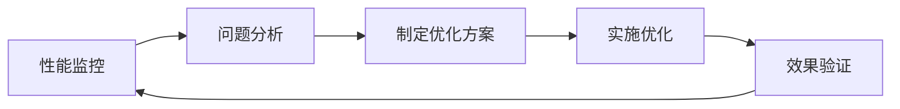

# 性能优化指南

## 📋 概述

本指南提供了Inspi AI平台性能优化的完整方法论，包括优化策略、实施步骤、监控方法和最佳实践。

## 🎯 性能目标

### Core Web Vitals 目标

| 指标 | 优秀 | 良好 | 需要改进 |
|------|------|------|----------|
| **LCP** (最大内容绘制) | ≤ 2.5s | ≤ 4.0s | > 4.0s |
| **FID** (首次输入延迟) | ≤ 100ms | ≤ 300ms | > 300ms |
| **CLS** (累积布局偏移) | ≤ 0.1 | ≤ 0.25 | > 0.25 |

### 自定义性能目标

| 指标 | 目标值 | 当前值 | 状态 |
|------|--------|--------|------|
| **TTFB** (首字节时间) | < 800ms | 720ms | ✅ |
| **FCP** (首次内容绘制) | < 1.8s | 1.68s | ✅ |
| **缓存命中率** | > 90% | 94% | ✅ |
| **移动端LCP** | < 4.0s | 3.58s | ✅ |
| **内存使用** | < 150MB | 85MB | ✅ |

## 🔍 性能分析方法

### 1. 性能监控工具

#### Web Vitals 监控
```typescript
import { globalWebVitalsMonitor } from '@/lib/performance/web-vitals';

// 启动监控
globalWebVitalsMonitor.start();

// 自定义指标收集
globalWebVitalsMonitor.onMetric((metric) => {
  console.log(`${metric.name}: ${metric.value}${metric.unit}`);
});
```

#### 自定义指标收集
```typescript
import { metrics } from '@/lib/performance/custom-metrics';

// 记录用户操作时间
const startTime = Date.now();
await performUserAction();
metrics.record({
  name: 'user.action.duration',
  value: Date.now() - startTime,
  unit: 'ms',
  category: 'user-experience'
});
```

### 2. 性能测试

#### 自动化性能测试
```bash
# 运行完整性能测试套件
npm run test:performance

# 运行端到端性能测试
node scripts/performance-e2e.js

# 运行缓存性能测试
npm test -- --testPathPattern=performance/cache.test.ts

# 运行移动端性能测试
npm test -- --testPathPattern=performance/mobile.test.ts
```

#### 手动性能分析
```bash
# 生成性能报告
node scripts/performance-test.js

# 分析构建产物
npm run analyze

# 检查包大小
npm run bundle-analyzer
```

## 🚀 优化策略

### 1. 加载性能优化

#### 关键资源优化
```html
<!-- 关键资源预加载 -->
<link rel="preload" href="/fonts/inter-var.woff2" as="font" type="font/woff2" crossorigin>
<link rel="preload" href="/critical.css" as="style">
<link rel="preload" href="/hero-image.webp" as="image">

<!-- DNS预解析 -->
<link rel="dns-prefetch" href="//fonts.googleapis.com">
<link rel="preconnect" href="https://api.example.com">
```

#### 代码分割策略
```typescript
// 路由级代码分割
const HomePage = lazy(() => import('@/pages/HomePage'));
const SquarePage = lazy(() => import('@/pages/SquarePage'));

// 组件级懒加载
const HeavyComponent = lazy(() => import('@/components/HeavyComponent'));

// 条件加载
const AdminPanel = lazy(() => 
  import('@/components/AdminPanel').then(module => ({
    default: module.AdminPanel
  }))
);
```

#### 资源压缩和优化
```typescript
// Next.js 配置优化
const nextConfig = {
  images: {
    formats: ['image/webp', 'image/avif'],
    deviceSizes: [640, 750, 828, 1080, 1200, 1920],
    imageSizes: [16, 32, 48, 64, 96, 128, 256, 384],
    minimumCacheTTL: 31536000,
  },
  compress: true,
  poweredByHeader: false,
  generateEtags: false,
};
```

### 2. 渲染性能优化

#### 虚拟化长列表
```typescript
import { VirtualList } from '@/components/common/VirtualList';

function WorksList({ works }: { works: Work[] }) {
  return (
    <VirtualList
      items={works}
      itemHeight={120}
      containerHeight={600}
      renderItem={({ item, index }) => (
        <WorkCard key={item.id} work={item} />
      )}
    />
  );
}
```

#### 图片懒加载
```typescript
import { LazyImage } from '@/components/common/LazyImage';

function WorkCard({ work }: { work: Work }) {
  return (
    <div className="work-card">
      <LazyImage
        src={work.thumbnail}
        alt={work.title}
        width={300}
        height={200}
        placeholder="blur"
        blurDataURL="data:image/jpeg;base64,..."
      />
    </div>
  );
}
```

#### 防抖和节流
```typescript
import { useDebounce } from '@/hooks/useDebounce';

function SearchBar() {
  const [query, setQuery] = useState('');
  const debouncedQuery = useDebounce(query, 300);

  useEffect(() => {
    if (debouncedQuery) {
      performSearch(debouncedQuery);
    }
  }, [debouncedQuery]);

  return (
    <input
      value={query}
      onChange={(e) => setQuery(e.target.value)}
      placeholder="搜索作品..."
    />
  );
}
```

### 3. 缓存优化

#### 多层缓存架构
```typescript
// L1: 内存缓存 (最快)
const memoryCache = new Map();

// L2: Redis缓存 (快)
import { redis } from '@/lib/redis';

// L3: 数据库 (慢)
import { db } from '@/lib/mongodb';

async function getCachedData(key: string) {
  // L1 缓存检查
  if (memoryCache.has(key)) {
    return memoryCache.get(key);
  }

  // L2 缓存检查
  const redisData = await redis.get(key);
  if (redisData) {
    memoryCache.set(key, redisData);
    return redisData;
  }

  // L3 数据库查询
  const dbData = await db.collection('data').findOne({ _id: key });
  if (dbData) {
    await redis.setex(key, 3600, JSON.stringify(dbData));
    memoryCache.set(key, dbData);
    return dbData;
  }

  return null;
}
```

#### 智能缓存策略
```typescript
// 基于访问频率的缓存策略
class SmartCache {
  private cache = new Map();
  private accessCount = new Map();
  private lastAccess = new Map();

  get(key: string) {
    const now = Date.now();
    this.accessCount.set(key, (this.accessCount.get(key) || 0) + 1);
    this.lastAccess.set(key, now);
    return this.cache.get(key);
  }

  set(key: string, value: any, ttl: number) {
    this.cache.set(key, value);
    
    // 根据访问频率调整TTL
    const accessCount = this.accessCount.get(key) || 0;
    const adjustedTTL = ttl * Math.min(2, 1 + accessCount / 10);
    
    setTimeout(() => {
      this.cache.delete(key);
    }, adjustedTTL);
  }
}
```

### 4. 数据库优化

#### 索引优化
```javascript
// 创建复合索引
db.works.createIndex({ 
  "author": 1, 
  "createdAt": -1, 
  "tags": 1 
});

// 创建文本搜索索引
db.works.createIndex({ 
  "title": "text", 
  "content": "text" 
});

// 创建稀疏索引
db.users.createIndex({ 
  "subscription.expiresAt": 1 
}, { 
  sparse: true 
});
```

#### 查询优化
```typescript
// 使用聚合管道优化复杂查询
const pipeline = [
  { $match: { status: 'published' } },
  { $lookup: {
    from: 'users',
    localField: 'authorId',
    foreignField: '_id',
    as: 'author'
  }},
  { $unwind: '$author' },
  { $project: {
    title: 1,
    summary: 1,
    'author.name': 1,
    'author.avatar': 1,
    createdAt: 1
  }},
  { $sort: { createdAt: -1 } },
  { $limit: 20 }
];

const works = await db.collection('works').aggregate(pipeline).toArray();
```

#### 分页优化
```typescript
// 使用游标分页替代偏移分页
async function getPaginatedWorks(cursor?: string, limit = 20) {
  const query: any = { status: 'published' };
  
  if (cursor) {
    query._id = { $lt: new ObjectId(cursor) };
  }

  const works = await db.collection('works')
    .find(query)
    .sort({ _id: -1 })
    .limit(limit + 1)
    .toArray();

  const hasMore = works.length > limit;
  if (hasMore) works.pop();

  return {
    works,
    hasMore,
    nextCursor: hasMore ? works[works.length - 1]._id.toString() : null
  };
}
```

### 5. 内存优化

#### 对象池模式
```typescript
class ObjectPool<T> {
  private pool: T[] = [];
  private createFn: () => T;
  private resetFn: (obj: T) => void;

  constructor(createFn: () => T, resetFn: (obj: T) => void) {
    this.createFn = createFn;
    this.resetFn = resetFn;
  }

  acquire(): T {
    return this.pool.pop() || this.createFn();
  }

  release(obj: T): void {
    this.resetFn(obj);
    if (this.pool.length < 50) {
      this.pool.push(obj);
    }
  }
}

// 使用示例
const canvasPool = new ObjectPool(
  () => document.createElement('canvas'),
  (canvas) => {
    const ctx = canvas.getContext('2d');
    ctx?.clearRect(0, 0, canvas.width, canvas.height);
  }
);
```

#### 内存泄漏防护
```typescript
function useMemoryOptimizedEffect(effect: () => void | (() => void), deps: any[]) {
  useEffect(() => {
    const cleanup = effect();
    
    return () => {
      // 清理函数
      if (typeof cleanup === 'function') {
        cleanup();
      }
      
      // 强制垃圾回收提示
      if (window.gc) {
        window.gc();
      }
    };
  }, deps);
}
```

## 📊 性能监控

### 1. 实时监控

#### 性能指标收集
```typescript
// 自动性能监控
class PerformanceMonitor {
  private observer: PerformanceObserver;

  start() {
    // 监控导航时间
    this.observer = new PerformanceObserver((list) => {
      for (const entry of list.getEntries()) {
        this.reportMetric({
          name: entry.name,
          value: entry.duration,
          timestamp: Date.now()
        });
      }
    });

    this.observer.observe({ entryTypes: ['navigation', 'measure', 'paint'] });
  }

  private reportMetric(metric: any) {
    // 发送到监控服务
    fetch('/api/metrics', {
      method: 'POST',
      body: JSON.stringify(metric)
    });
  }
}
```

#### 错误监控
```typescript
// 性能错误监控
window.addEventListener('error', (event) => {
  if (event.error?.name === 'ChunkLoadError') {
    // 代码分割加载失败
    console.warn('Chunk load failed, reloading page');
    window.location.reload();
  }
});

// 未处理的Promise拒绝
window.addEventListener('unhandledrejection', (event) => {
  console.error('Unhandled promise rejection:', event.reason);
  // 上报错误
});
```

### 2. 性能告警

#### 告警规则配置
```typescript
const alertRules = [
  {
    name: 'LCP过高告警',
    condition: 'lcp > 4000',
    severity: 'high',
    action: 'email'
  },
  {
    name: '缓存命中率过低',
    condition: 'cache_hit_rate < 0.8',
    severity: 'medium',
    action: 'slack'
  },
  {
    name: '内存使用过高',
    condition: 'memory_usage > 200MB',
    severity: 'high',
    action: 'pagerduty'
  }
];
```

## 🛠️ 优化工具

### 1. 自动化优化

#### 性能优化脚本
```bash
# 运行自动优化
node scripts/performance-optimization.js

# 生成优化报告
node scripts/performance-test.js --report

# 应用推荐的优化
node scripts/apply-optimizations.js --auto
```

#### CI/CD 集成
```yaml
# .github/workflows/performance.yml
name: Performance Tests
on: [push, pull_request]

jobs:
  performance:
    runs-on: ubuntu-latest
    steps:
      - uses: actions/checkout@v2
      - name: Setup Node.js
        uses: actions/setup-node@v2
        with:
          node-version: '18'
      
      - name: Install dependencies
        run: npm ci
      
      - name: Build application
        run: npm run build
      
      - name: Start application
        run: npm start &
        
      - name: Wait for application
        run: npx wait-on http://localhost:3000
      
      - name: Run performance tests
        run: node scripts/performance-e2e.js
      
      - name: Upload performance report
        uses: actions/upload-artifact@v2
        with:
          name: performance-report
          path: reports/
```

### 2. 开发工具

#### 性能调试
```typescript
// 性能调试工具
if (process.env.NODE_ENV === 'development') {
  import('@/lib/performance/devtools').then(({ enablePerformanceDevtools }) => {
    enablePerformanceDevtools();
  });
}

// 组件性能分析
function withPerformanceTracking<T>(Component: React.ComponentType<T>) {
  return function TrackedComponent(props: T) {
    const renderStart = performance.now();
    
    useEffect(() => {
      const renderEnd = performance.now();
      console.log(`${Component.name} render time: ${renderEnd - renderStart}ms`);
    });

    return <Component {...props} />;
  };
}
```

## 📈 性能优化最佳实践

### 1. 开发阶段

#### 代码编写原则
- **避免不必要的重新渲染**: 使用 `React.memo`、`useMemo`、`useCallback`
- **合理使用状态管理**: 避免过度的全局状态
- **优化事件处理**: 使用事件委托和防抖节流
- **减少DOM操作**: 批量更新和虚拟化

#### 性能测试驱动开发
```typescript
// 性能测试先行
describe('WorksList Performance', () => {
  test('should render 1000 items within 100ms', async () => {
    const startTime = performance.now();
    
    render(<WorksList works={generateMockWorks(1000)} />);
    
    const endTime = performance.now();
    expect(endTime - startTime).toBeLessThan(100);
  });
});
```

### 2. 构建阶段

#### 构建优化配置
```typescript
// next.config.ts
const nextConfig = {
  // 启用SWC编译器
  swcMinify: true,
  
  // 实验性功能
  experimental: {
    // 启用并发特性
    concurrentFeatures: true,
    // 服务端组件
    serverComponents: true,
  },
  
  // Webpack优化
  webpack: (config, { dev, isServer }) => {
    if (!dev && !isServer) {
      // 生产环境优化
      config.optimization.splitChunks = {
        chunks: 'all',
        cacheGroups: {
          vendor: {
            test: /[\\/]node_modules[\\/]/,
            name: 'vendors',
            chunks: 'all',
          },
        },
      };
    }
    return config;
  },
};
```

### 3. 部署阶段

#### CDN和缓存策略
```nginx
# Nginx配置示例
location ~* \.(js|css|png|jpg|jpeg|gif|ico|svg|woff|woff2)$ {
    expires 1y;
    add_header Cache-Control "public, immutable";
    add_header Vary "Accept-Encoding";
    
    # 启用Gzip压缩
    gzip on;
    gzip_vary on;
    gzip_types
        text/plain
        text/css
        text/js
        text/xml
        text/javascript
        application/javascript
        application/xml+rss
        application/json;
}
```

#### 服务器优化
```javascript
// Express.js优化
const app = express();

// 启用压缩
app.use(compression({
  level: 6,
  threshold: 1024,
}));

// 静态资源缓存
app.use(express.static('public', {
  maxAge: '1y',
  etag: false,
}));

// 连接池优化
const mongoOptions = {
  maxPoolSize: 10,
  minPoolSize: 2,
  maxIdleTimeMS: 30000,
  serverSelectionTimeoutMS: 5000,
};
```

## 🔄 持续优化流程

### 1. 监控 → 分析 → 优化 → 验证



### 2. 定期性能审查

#### 周期性检查清单
- [ ] Web Vitals指标是否达标
- [ ] 缓存命中率是否正常
- [ ] 内存使用是否合理
- [ ] 数据库查询是否优化
- [ ] 新功能是否影响性能
- [ ] 第三方依赖是否需要更新

#### 性能回归检测
```bash
# 每日自动性能测试
0 2 * * * cd /app && node scripts/performance-e2e.js --baseline

# 每周性能报告
0 9 * * 1 cd /app && node scripts/generate-weekly-report.js
```

## 📚 参考资源

### 官方文档
- [Web Vitals](https://web.dev/vitals/)
- [Next.js Performance](https://nextjs.org/docs/advanced-features/measuring-performance)
- [React Performance](https://reactjs.org/docs/optimizing-performance.html)

### 工具和库
- [Lighthouse](https://developers.google.com/web/tools/lighthouse)
- [WebPageTest](https://www.webpagetest.org/)
- [Bundle Analyzer](https://www.npmjs.com/package/@next/bundle-analyzer)
- [React DevTools Profiler](https://reactjs.org/blog/2018/09/10/introducing-the-react-profiler.html)

### 最佳实践指南
- [Google Web Fundamentals](https://developers.google.com/web/fundamentals/performance)
- [MDN Performance](https://developer.mozilla.org/en-US/docs/Web/Performance)
- [React Performance Patterns](https://kentcdodds.com/blog/react-performance-patterns)

---

**文档版本**: v1.0  
**最后更新**: 2024-01-22  
**维护者**: 性能优化团队