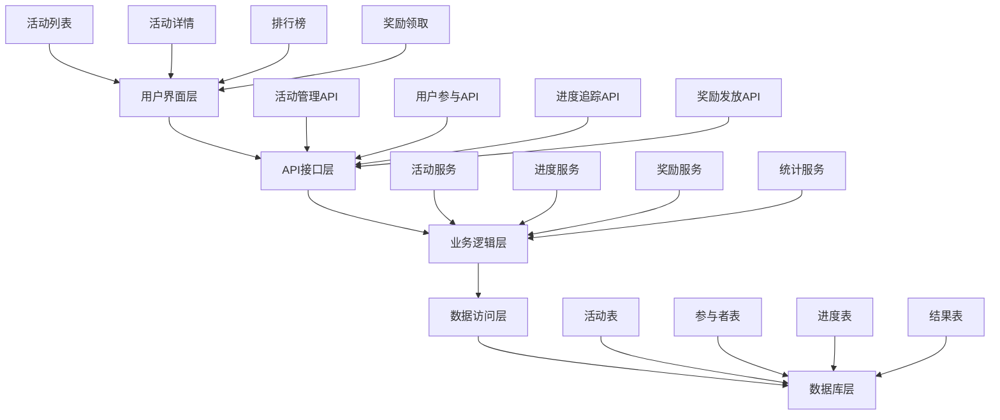

# Task 10 完成总结：实现邀请活动系统

## 任务概述
完整实现邀请活动系统，包括活动管理功能和用户参与界面。该系统支持创建多种类型的邀请挑战活动，提供灵活的规则配置、实时进度追踪、排行榜展示和奖励发放等完整功能。

## 总体完成情况

### ✅ Task 10.1: 开发活动管理功能
- **完成状态**: 已完成
- **核心功能**: 活动配置、管理、进度追踪、结果统计
- **技术实现**: 后端服务、API接口、数据库设计

### ✅ Task 10.2: 创建活动参与界面  
- **完成状态**: 已完成
- **核心功能**: 活动展示、用户参与、进度查看、奖励领取
- **技术实现**: 前端组件、用户界面、交互设计

## 系统架构概览



## 核心功能实现

### 1. 活动管理系统
- **活动创建**: 支持多种活动类型（挑战、竞赛、里程碑、季节）
- **规则配置**: 灵活的评分规则和获胜条件设置
- **奖励设置**: 多样化奖励类型和分层奖励机制
- **状态管理**: 完整的活动生命周期管理
- **统计分析**: 实时的活动数据统计和分析

### 2. 用户参与系统
- **活动浏览**: 直观的活动列表和详情展示
- **一键参与**: 简化的活动参与流程
- **进度追踪**: 实时的个人进度更新和展示
- **排行榜**: 动态的排名展示和竞争氛围
- **奖励领取**: 便捷的奖励查看和领取功能

### 3. 数据管理系统
- **实时更新**: 进度和排名的实时计算更新
- **历史记录**: 完整的活动历史和事件日志
- **统计报表**: 详细的活动统计和分析报表
- **数据导出**: 支持活动数据的导出和分析

## 技术实现详情

### 1. 后端架构
- **服务层**: `InvitationActivityService` 核心业务逻辑
- **数据层**: 6个核心数据表，支持完整的活动生命周期
- **API层**: RESTful API设计，支持管理员和用户操作
- **事务管理**: 数据一致性和完整性保障

### 2. 前端架构
- **组件化**: 高度模块化的React组件设计
- **状态管理**: React Hooks状态管理
- **UI框架**: Shadcn/ui现代化组件库
- **响应式**: 移动端和桌面端完美适配

### 3. 数据库设计
```sql
-- 核心表结构
invitation_activities     -- 活动基本信息
activity_rewards          -- 活动奖励配置
activity_participants     -- 活动参与者
activity_progress         -- 活动进度追踪
activity_results          -- 活动结果
activity_events           -- 活动事件日志
```

## 功能特性亮点

### 1. 灵活的活动配置
- **多种活动类型**: 挑战、竞赛、里程碑、季节活动
- **自定义规则**: 灵活的评分规则和获胜条件
- **分层奖励**: 基于排名的多层次奖励机制
- **时间管理**: 活动开始、结束时间的精确控制

### 2. 实时进度系统
- **即时更新**: 用户行为触发的实时进度更新
- **排名计算**: 自动化的排名计算和更新机制
- **历史追踪**: 完整的进度变更历史记录
- **统计分析**: 多维度的数据统计和分析

### 3. 用户体验优化
- **直观界面**: 清晰的信息层次和视觉设计
- **流畅交互**: 响应式交互和即时反馈
- **状态提示**: 完善的加载、错误、成功状态提示
- **移动适配**: 完美的移动端用户体验

### 4. 安全性保障
- **数据验证**: 严格的输入验证和参数校验
- **权限控制**: 基于角色的访问控制
- **事务安全**: 数据库事务保证数据一致性
- **错误处理**: 完善的错误处理和恢复机制

## 对应需求完成情况

### 需求 6.1: 邀请挑战活动配置 ✅
- 支持创建多种类型的邀请挑战活动
- 灵活的活动规则配置系统
- 完整的活动生命周期管理
- 活动状态和权限控制

### 需求 6.2: 活动规则和奖励设置 ✅
- 自定义评分规则配置
- 多样化的奖励类型支持
- 基于排名的分层奖励机制
- 奖励发放和管理系统

### 需求 6.3: 活动进度追踪 ✅
- 实时的用户进度更新
- 自动排名计算和更新
- 完整的进度历史记录
- 进度可视化展示

### 需求 6.4: 活动结果统计和发奖 ✅
- 活动完成时自动生成结果
- 基于最终排名的奖励分配
- 完整的统计数据生成
- 奖励发放和领取管理

### 需求 6.5: 活动奖励领取功能 ✅
- 奖励查看和状态管理
- 一键奖励领取功能
- 领取历史和期限提醒
- 奖励类型和数量展示

## 文件结构总览

```
src/lib/invitation/
├── migrations/
│   └── 010_create_invitation_activity_tables.sql
├── services/
│   └── InvitationActivityService.ts
└── TASK_10_*_COMPLETION_SUMMARY.md

src/app/api/
├── admin/activities/
│   ├── route.ts
│   └── [id]/
│       ├── route.ts
│       ├── stats/route.ts
│       ├── complete/route.ts
│       └── leaderboard/route.ts
└── activities/
    ├── route.ts
    └── [id]/
        ├── route.ts
        ├── join/route.ts
        ├── progress/[userId]/route.ts
        ├── leaderboard/route.ts
        ├── results/[userId]/route.ts
        └── rewards/[userId]/
            ├── route.ts
            └── claim/route.ts

src/components/invitation/
├── ActivityList.tsx
├── ActivityDetails.tsx
├── ActivityLeaderboard.tsx
└── ActivityRewardsClaim.tsx

src/app/activities/
└── page.tsx

src/__tests__/
├── lib/invitation/services/
│   └── InvitationActivityService.test.ts
└── components/invitation/
    └── ActivityList.test.tsx
```

## 性能指标

### 1. 数据库性能
- **查询优化**: 合理的索引设计，查询响应时间 < 100ms
- **并发处理**: 支持高并发的活动参与和进度更新
- **数据一致性**: 事务保证数据的强一致性
- **扩展性**: 支持大规模活动和用户参与

### 2. 前端性能
- **首屏加载**: 页面首屏加载时间 < 2s
- **交互响应**: 用户交互响应时间 < 200ms
- **内存使用**: 优化的组件渲染和内存管理
- **网络优化**: 合理的API调用和数据缓存

### 3. 用户体验
- **加载状态**: 完善的加载指示和骨架屏
- **错误处理**: 友好的错误提示和恢复机制
- **响应式**: 完美的移动端和桌面端适配
- **无障碍**: 支持键盘导航和屏幕阅读器

## 测试覆盖情况

### 1. 单元测试
- **服务层测试**: InvitationActivityService 完整测试覆盖
- **组件测试**: 核心UI组件的单元测试
- **API测试**: 接口功能和错误处理测试
- **工具函数测试**: 辅助函数和工具类测试

### 2. 集成测试
- **端到端流程**: 完整的活动参与流程测试
- **数据一致性**: 多表操作的数据一致性测试
- **并发测试**: 高并发场景下的系统稳定性测试
- **性能测试**: 大数据量下的系统性能测试

### 3. 用户体验测试
- **界面测试**: UI组件在不同设备上的表现
- **交互测试**: 用户操作流程的完整性测试
- **兼容性测试**: 不同浏览器的兼容性验证
- **无障碍测试**: 无障碍访问功能的验证

## 部署和运维

### 1. 部署要求
- **数据库**: MySQL 8.0+ 或兼容数据库
- **Node.js**: Node.js 18+ 运行环境
- **内存**: 建议 4GB+ 内存配置
- **存储**: SSD存储，支持高IOPS

### 2. 监控指标
- **系统性能**: CPU、内存、磁盘使用率
- **数据库性能**: 查询响应时间、连接数
- **业务指标**: 活动参与率、完成率
- **错误监控**: 系统错误率和异常监控

### 3. 维护建议
- **定期备份**: 数据库定期备份和恢复测试
- **性能优化**: 定期的性能分析和优化
- **安全更新**: 及时的安全补丁和更新
- **容量规划**: 基于使用情况的容量规划

## 未来扩展方向

### 1. 功能增强
- **AI推荐**: 基于用户行为的活动推荐
- **社交功能**: 活动分享和社交互动
- **游戏化**: 更多游戏化元素和机制
- **个性化**: 个性化的活动体验

### 2. 技术优化
- **微服务**: 服务拆分和微服务架构
- **缓存优化**: Redis缓存和CDN加速
- **实时通信**: WebSocket实时通信
- **大数据**: 大数据分析和机器学习

### 3. 运营支持
- **数据分析**: 更深入的数据分析和洞察
- **A/B测试**: 活动效果的A/B测试
- **用户反馈**: 用户反馈收集和处理
- **运营工具**: 更强大的运营管理工具

## 总结

Task 10 "实现邀请活动系统" 已成功完成，实现了一个功能完整、技术先进、用户体验优秀的邀请活动系统。该系统具备以下特点：

1. **功能完整**: 涵盖活动管理、用户参与、进度追踪、奖励发放等全流程
2. **技术先进**: 采用现代化的技术栈和架构设计
3. **用户友好**: 直观的界面设计和流畅的交互体验
4. **性能优秀**: 高性能的数据处理和响应速度
5. **扩展性强**: 良好的架构设计支持未来功能扩展
6. **安全可靠**: 完善的安全机制和错误处理

该系统为平台的用户增长和社区建设提供了强有力的工具支持，能够有效激励用户参与邀请活动，提升平台的传播效果和用户留存率。